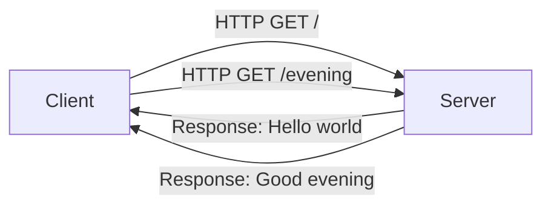
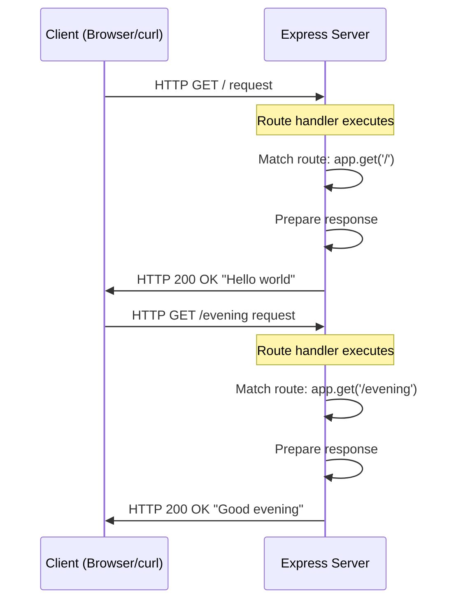
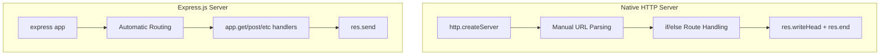
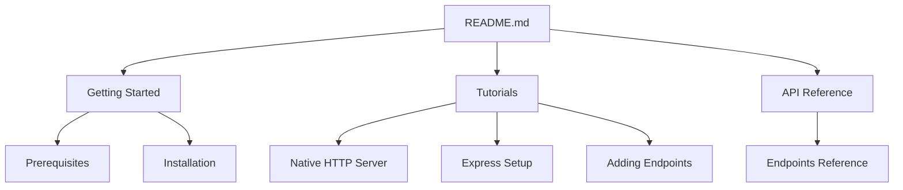

# Node.js Server Tutorial

A comprehensive tutorial for learning Node.js server development, progressing from native HTTP server implementation to Express.js framework integration.

## Table of Contents

- [Overview](#overview)
- [Quick Start](#quick-start)
- [Prerequisites](#prerequisites)
- [Native HTTP Server](#native-http-server)
- [Express.js Setup](#expressjs-setup)
- [API Reference](#api-reference)
- [Architecture](#architecture)
- [Testing](#testing)
- [Documentation](#documentation)
- [License](#license)

## Overview

### Project Description

This tutorial project demonstrates how to build HTTP servers with Node.js, covering both the native `http` module approach and the popular Express.js framework. You'll learn how to create RESTful API endpoints that respond to HTTP requests with simple text responses.

### Learning Objectives

By completing this tutorial, you will:

- **Understand Native HTTP Servers**: Learn how Node.js handles HTTP requests using the built-in `http` module
- **Master Express.js Integration**: Discover how to add Express.js to your project and leverage its powerful routing capabilities
- **Implement Multiple Endpoints**: Create different API routes that return specific responses
- **Compare Approaches**: Understand the differences between native HTTP and Express.js implementations

### Target Audience

This tutorial is designed for **beginner to intermediate developers** who:

- Have basic JavaScript knowledge
- Want to learn server-side development with Node.js
- Are interested in building RESTful APIs
- Want to understand the fundamentals before using frameworks

## Quick Start

Get up and running in minutes with these commands:

### 1. Clone and Initialize

```bash
# Create project directory
mkdir my-node-server
cd my-node-server

# Initialize npm project
npm init -y
```

### 2. Install Express.js

```bash
npm install express@5.2.1
```

### 3. Create the Application

Create a file named `app.js` with the following content:

```javascript
const express = require('express');
const app = express();
const PORT = 3000;

// Hello world endpoint
app.get('/', (req, res) => {
  res.send('Hello world');
});

// Good evening endpoint
app.get('/evening', (req, res) => {
  res.send('Good evening');
});

app.listen(PORT, () => {
  console.log(`Server running at http://localhost:${PORT}/`);
});
```

### 4. Run the Server

```bash
node app.js
```

### 5. Test the Endpoints

```bash
# Test Hello world endpoint
curl http://localhost:3000/
# Expected output: Hello world

# Test Good evening endpoint
curl http://localhost:3000/evening
# Expected output: Good evening
```

## Prerequisites

Before starting this tutorial, ensure you have the following installed:

### Required Software

| Software | Version | Purpose |
|----------|---------|---------|
| Node.js | 22.x LTS (Jod) | JavaScript runtime environment |
| npm | 10.x | Package manager (bundled with Node.js) |

### Verify Installation

```bash
# Check Node.js version
node --version
# Expected: v22.x.x

# Check npm version
npm --version
# Expected: 10.x.x
```

### System Requirements

- **Operating System**: Windows, macOS, or Linux
- **Terminal**: Bash, PowerShell, or CMD for running commands
- **Text Editor**: VS Code recommended (any editor with JavaScript support works)

> **Note**: Express.js 5.x requires Node.js 18 or higher. Node.js 22.x LTS is recommended for the best experience.

For detailed prerequisites and setup instructions, see [Prerequisites Documentation](docs/getting-started/prerequisites.md).

## Native HTTP Server

Before diving into Express.js, it's valuable to understand how Node.js handles HTTP requests natively.

### Basic HTTP Server Implementation

Node.js includes a built-in `http` module that allows you to create HTTP servers without any external dependencies:

```javascript
// server.js - Native Node.js HTTP Server
const http = require('http');

const PORT = 3000;

// Create the HTTP server
const server = http.createServer((req, res) => {
  // Route handling for root path
  if (req.url === '/' && req.method === 'GET') {
    res.writeHead(200, { 'Content-Type': 'text/plain' });
    res.end('Hello world');
  } else {
    // Handle 404 for other paths
    res.writeHead(404, { 'Content-Type': 'text/plain' });
    res.end('Not Found');
  }
});

// Start the server
server.listen(PORT, () => {
  console.log(`Server running at http://localhost:${PORT}/`);
});
```

### Key Concepts

1. **`http.createServer()`**: Creates an HTTP server that calls the callback function for each incoming request
2. **Request Object (`req`)**: Contains information about the incoming HTTP request (URL, method, headers)
3. **Response Object (`res`)**: Used to send data back to the client
4. **`res.writeHead()`**: Sets the HTTP status code and response headers
5. **`res.end()`**: Sends the response body and signals the response is complete

### Running the Native Server

```bash
# Save the code as server.js and run:
node server.js

# Test the endpoint:
curl http://localhost:3000/
# Output: Hello world
```

### Limitations of Native HTTP

While the native `http` module works well for simple servers, it has limitations:

- Manual URL parsing and routing
- No built-in middleware support
- Verbose code for common operations
- Limited request body parsing

This is where Express.js shines.

For a complete step-by-step tutorial, see [Native HTTP Server Tutorial](docs/tutorials/native-http-server.md).

## Express.js Setup

Express.js is a minimal and flexible Node.js web application framework that provides robust features for building web applications and APIs.

### Why Express.js?

| Feature | Native HTTP | Express.js |
|---------|-------------|------------|
| Routing | Manual if/else checks | Built-in router with method handlers |
| Response | `res.writeHead()` + `res.end()` | Simple `res.send()` |
| Middleware | Not available | Powerful middleware system |
| Code Clarity | Verbose | Concise and readable |

### Installation

```bash
npm install express@5.2.1
```

### Express.js Application Structure

```javascript
// app.js - Express.js Application
const express = require('express');
const app = express();
const PORT = 3000;

// Define routes
app.get('/', (req, res) => {
  res.send('Hello world');
});

app.get('/evening', (req, res) => {
  res.send('Good evening');
});

// Start the server
app.listen(PORT, () => {
  console.log(`Server running at http://localhost:${PORT}/`);
});
```

### Key Express.js Concepts

1. **`express()`**: Creates an Express application instance
2. **`app.get(path, handler)`**: Defines a route handler for GET requests
3. **`res.send()`**: Sends a response (automatically sets Content-Type)
4. **`app.listen(port, callback)`**: Binds and listens for connections on the specified port

### Migration from Native HTTP to Express

Here's how the code transforms when migrating:

**Native HTTP (before):**
```javascript
if (req.url === '/' && req.method === 'GET') {
  res.writeHead(200, { 'Content-Type': 'text/plain' });
  res.end('Hello world');
}
```

**Express.js (after):**
```javascript
app.get('/', (req, res) => {
  res.send('Hello world');
});
```

Express.js significantly reduces boilerplate while providing more powerful features.

For a detailed Express.js setup guide, see [Express.js Setup Tutorial](docs/tutorials/express-setup.md).

## API Reference

This section documents all available API endpoints in the tutorial server.

### Endpoints Overview

| Method | Endpoint | Description | Response |
|--------|----------|-------------|----------|
| GET | `/` | Root endpoint | `Hello world` |
| GET | `/evening` | Evening greeting endpoint | `Good evening` |

### GET /

Returns a greeting message.

**Request:**
```bash
curl http://localhost:3000/
```

**Response:**
```
HTTP/1.1 200 OK
Content-Type: text/plain

Hello world
```

### GET /evening

Returns an evening greeting message.

**Request:**
```bash
curl http://localhost:3000/evening
```

**Response:**
```
HTTP/1.1 200 OK
Content-Type: text/plain

Good evening
```

### Error Handling

For undefined routes, the server returns a 404 Not Found response:

```bash
curl http://localhost:3000/undefined-path
# Returns: Cannot GET /undefined-path (Express default)
```

For comprehensive API documentation, see [API Reference Documentation](docs/api-reference/endpoints.md).

## Architecture

### Client-Server Interaction

The following diagram shows how clients interact with the server:



### HTTP Request Lifecycle

This sequence diagram illustrates the complete request/response cycle:



### Native vs Express Architecture Comparison



### Documentation Structure



## Testing

### Verification Steps

Follow these steps to verify your server is working correctly:

#### 1. Start the Server

```bash
node app.js
```

You should see:
```
Server running at http://localhost:3000/
```

#### 2. Test Hello World Endpoint

```bash
curl http://localhost:3000/
```

**Expected Response:**
```
Hello world
```

#### 3. Test Good Evening Endpoint

```bash
curl http://localhost:3000/evening
```

**Expected Response:**
```
Good evening
```

### Verification Checklist

- [ ] Server starts without errors
- [ ] GET `/` returns `Hello world`
- [ ] GET `/evening` returns `Good evening`
- [ ] Both responses return HTTP 200 OK status

### Browser Testing

You can also test the endpoints in your web browser:

1. Open your browser
2. Navigate to `http://localhost:3000/` - You should see "Hello world"
3. Navigate to `http://localhost:3000/evening` - You should see "Good evening"

## Documentation

### Getting Started

- [Prerequisites](docs/getting-started/prerequisites.md) - System requirements and environment setup
- [Installation Guide](docs/getting-started/installation.md) - Step-by-step installation instructions

### Tutorials

- [Native HTTP Server](docs/tutorials/native-http-server.md) - Learn how to create a basic HTTP server with Node.js
- [Express.js Setup](docs/tutorials/express-setup.md) - Set up Express.js and understand its benefits
- [Adding Endpoints](docs/tutorials/adding-endpoints.md) - Create multiple API endpoints with Express routing

### Reference

- [API Endpoints](docs/api-reference/endpoints.md) - Complete API endpoint documentation

### Code Examples

- [Native HTTP Server Example](docs/examples/server.js) - Complete native Node.js HTTP server code
- [Express.js Application Example](docs/examples/app.js) - Complete Express.js application code

## Project Structure

```
nodejs-server-tutorial/
├── README.md                  # This file
├── package.json               # Project configuration
├── app.js                     # Express.js application (main entry point)
├── docs/
│   ├── getting-started/
│   │   ├── prerequisites.md   # Environment requirements
│   │   └── installation.md    # Setup instructions
│   ├── tutorials/
│   │   ├── native-http-server.md    # Native HTTP tutorial
│   │   ├── express-setup.md         # Express.js tutorial
│   │   └── adding-endpoints.md      # Multiple endpoints tutorial
│   ├── api-reference/
│   │   └── endpoints.md       # API documentation
│   └── examples/
│       ├── server.js          # Native HTTP example
│       └── app.js             # Express.js example
└── node_modules/              # Dependencies (generated)
```

## License

This tutorial project is released under the MIT License.

---

**Happy coding!** 🚀

If you have questions or need help, refer to the detailed documentation linked above or consult the official [Node.js](https://nodejs.org/en/docs/) and [Express.js](https://expressjs.com/) documentation.
