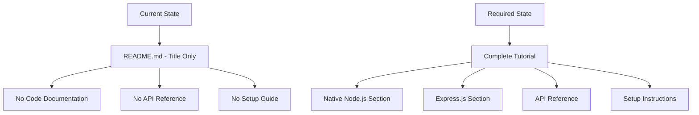
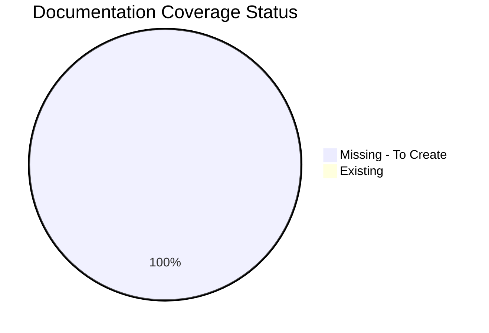
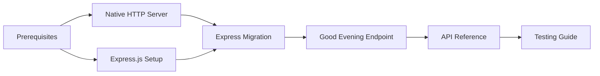
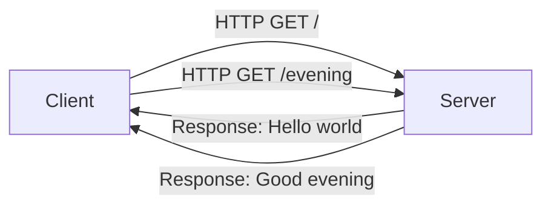
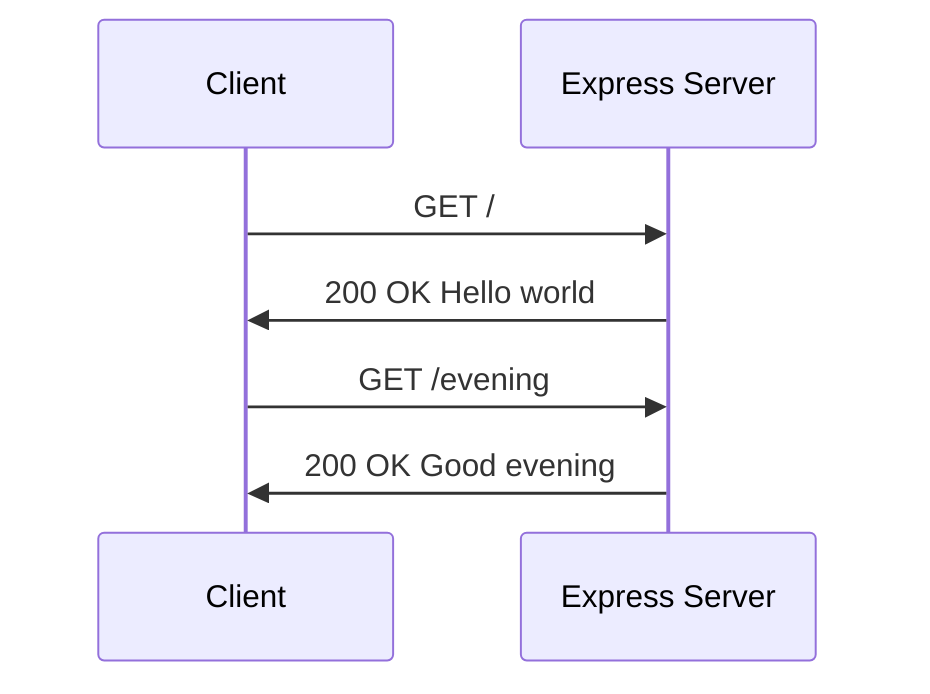
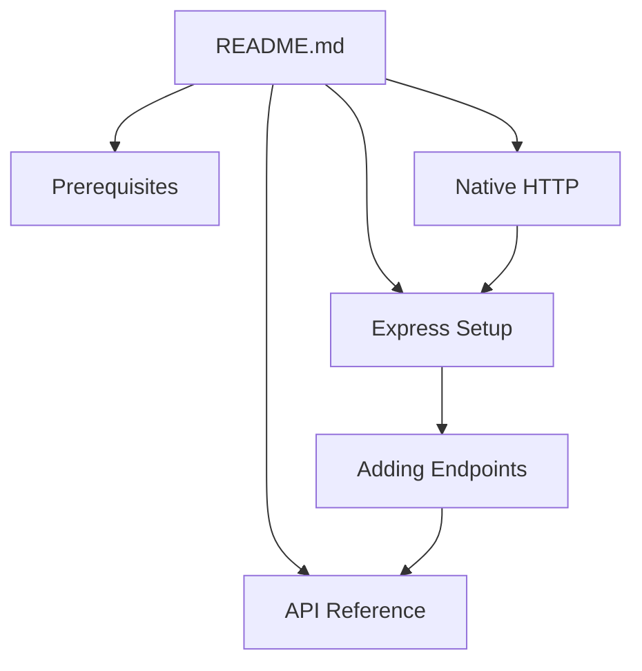
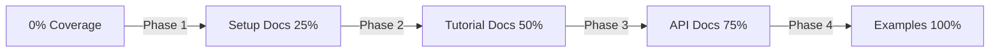
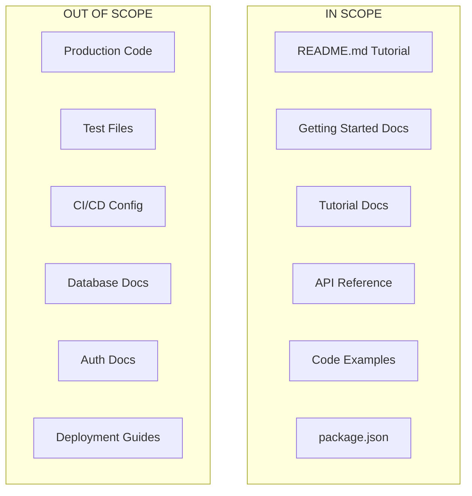

# Technical Specification

# 0. Agent Action Plan

## 0.1 Intent Clarification

### 0.1.1 Core Documentation Objective

Based on the provided requirements, the Blitzy platform understands that the documentation objective is to **create and update documentation for a Node.js server tutorial** that demonstrates adding Express.js to an existing project and implementing a new API endpoint.

| Attribute | Details |
|-----------|---------|
| **Request Category** | Create new documentation |
| **Documentation Type** | Tutorial / How-To Guide |
| **Project Status** | Inception phase with minimal documentation |
| **Target Audience** | Developers learning Node.js server development |

**Documentation Requirements Breakdown:**

| Requirement ID | User Requirement | Enhanced Clarification |
|----------------|------------------|------------------------|
| DOC-001 | Document Node.js server hosting one endpoint returning "Hello world" | Create foundational tutorial documentation for a basic HTTP server implementation using native Node.js |
| DOC-002 | Add Express.js into the project | Document Express.js integration including installation, configuration, and migration of existing endpoint |
| DOC-003 | Add another endpoint returning "Good evening" | Document the creation of a new Express.js route handler demonstrating multiple endpoint patterns |

**Implicit Documentation Needs Identified:**

- Prerequisites and environment setup documentation
- Package.json configuration and dependency management
- Code examples with explanations for both native Node.js and Express.js approaches
- Comparison of native HTTP server vs Express.js patterns
- Testing instructions for verifying endpoint functionality
- Project structure documentation

### 0.1.2 Special Instructions and Constraints

| Directive Type | Details |
|----------------|---------|
| **Style Preference** | Tutorial-style documentation with step-by-step instructions |
| **Tone** | Educational, beginner-friendly |
| **Structure** | Progressive learning path (basic → advanced) |
| **Format** | Markdown with code examples |
| **Examples Required** | Complete working code snippets for each endpoint |

**User-Provided Examples:**

User Example - Hello World Endpoint Response:
```
"Hello world"
```

User Example - Good Evening Endpoint Response:
```
"Good evening"
```

**Documentation Template Requirements:**
- No specific template provided by user
- Follow standard Node.js tutorial conventions
- Include Mermaid diagrams for architecture visualization

### 0.1.3 Technical Interpretation

These documentation requirements translate to the following technical documentation strategy:

| Requirement | Documentation Action | Target Files |
|-------------|---------------------|--------------|
| Document basic Node.js server | Create README.md with complete tutorial content | README.md |
| Document Express.js integration | Create or update documentation with Express installation and setup | README.md, docs/express-setup.md |
| Document new endpoint | Add code examples and explanations for the "Good evening" route | README.md, docs/api-reference.md |
| Document project configuration | Create package.json documentation | README.md, package.json |

**Technical Translation:**
- To document the basic Node.js server, we will create comprehensive README.md content explaining native HTTP server implementation with the "Hello world" endpoint
- To document Express.js integration, we will update README.md and create supplementary documentation showing the migration from native HTTP to Express.js
- To document the new endpoint, we will add detailed code examples demonstrating Express.js route definitions for the "Good evening" response
- To document dependencies, we will include package.json setup instructions with exact version specifications

### 0.1.4 Inferred Documentation Needs

Based on code analysis and project structure, the following implicit documentation needs have been identified:

| Inference Source | Identified Gap | Documentation Need |
|------------------|----------------|-------------------|
| Repository structure | No existing documentation beyond README title | Complete tutorial documentation from scratch |
| User request context | No package.json exists | Document npm initialization and dependency installation |
| Express.js requirement | Framework migration path needed | Document both native and Express approaches |
| Multiple endpoints | API reference needed | Create endpoint documentation with request/response examples |
| Tutorial nature | Learning objectives undefined | Add clear prerequisites and learning outcomes |

**Documentation Gap Assessment:**




## 0.2 Documentation Discovery and Analysis

### 0.2.1 Existing Documentation Infrastructure Assessment

Repository analysis conducted to identify existing documentation structure and tooling.

**Search Patterns Employed:**

| Pattern | Purpose | Results |
|---------|---------|---------|
| `README*` | Landing page documentation | 1 file found (README.md) |
| `docs/**` | Documentation directory | Not found |
| `*.md, *.mdx, *.rst` | Documentation files | 1 file found |
| `package.json` | Node.js configuration | Not found |
| `.nvmrc` | Node.js version specification | Not found |
| `mkdocs.yml, docusaurus.config.js` | Documentation generators | Not found |

**Repository Analysis Summary:**

| Attribute | Current Status |
|-----------|----------------|
| **Documentation Status** | Minimal - README.md contains only project identifier heading |
| **Documentation Framework** | None detected |
| **API Documentation Tools** | None configured |
| **Diagram Tools** | None configured |
| **Documentation Hosting** | Not configured |

**Findings:**

Repository analysis reveals a **skeletal documentation structure** with only a single README.md file containing a level-1 heading "3dec_-1". The project is in the inception phase with:
- No existing tutorial content
- No code examples documented
- No package configuration files
- No documentation generator tooling

### 0.2.2 Repository Code Analysis for Documentation

Since this is a documentation task for a **new tutorial**, the repository currently lacks source code. The documentation will guide users in creating the following code structure:

**Proposed Code Structure to Document:**

| Target Code File | Purpose | Documentation Requirement |
|------------------|---------|--------------------------|
| `server.js` | Main server entry point | Document native HTTP server implementation |
| `app.js` | Express.js application | Document Express.js setup and routes |
| `package.json` | Project configuration | Document dependencies and scripts |
| `routes/greeting.js` | Route handlers | Document endpoint implementations |

**Search Patterns for Documentation Sources:**

| Pattern | Purpose | Status |
|---------|---------|--------|
| `src/**/*.js` | Source code files | Not found - To be created via documentation |
| `examples/**` | Example code | Not found - To be created |
| `tests/**` | Test files for examples | Not found - Optional |

### 0.2.3 Web Search Research Conducted

Research conducted to inform documentation best practices:

| Research Topic | Key Findings |
|----------------|--------------|
| Express.js Latest Version | <cite index="2-2">Latest version: 5.2.1, last published: 21 hours ago.</cite> |
| Express.js Framework Description | <cite index="5-15,5-16">Express.js, or simply Express, is a back end web application framework for Node.js, released as free and open-source software under the MIT License. It is designed for building web applications and APIs.</cite> |
| Express.js 5.0 Release | <cite index="4-1,4-2">Express.js has finally published version 5.0 on October 15, 2024. This marks a significant milestone, coming after a 10-year wait since the initial pull request was opened in July 2014.</cite> |
| Node.js Version Requirements | <cite index="1-2">Node.js version support: Dropped support for Node.js versions before v18.</cite> |
| Node.js 22 LTS Status | <cite index="18-1">On October 29, 2024, Node.js v22 officially transitioned into Long Term Support (LTS) with the codename 'Jod'.</cite> |

**Recommended Documentation Stack:**

| Tool | Version | Purpose | Justification |
|------|---------|---------|---------------|
| Node.js | 22.x LTS | Runtime environment | Current Active LTS version |
| Express.js | 5.2.1 | Web framework | Latest stable release |
| npm | 10.x | Package manager | Bundled with Node.js 22.x |
| Mermaid | N/A | Diagram generation | Markdown-native diagrams |

### 0.2.4 Documentation Standards Assessment

Based on the tutorial nature of this project, the following documentation standards apply:

| Standard | Application |
|----------|-------------|
| **Structure** | Progressive tutorial format (basic → advanced) |
| **Code Blocks** | Use fenced code blocks with language specification |
| **Examples** | Complete, runnable code snippets |
| **Commands** | Include exact shell commands for setup |
| **Diagrams** | Mermaid diagrams for architecture visualization |
| **Cross-References** | Internal links between documentation sections |


## 0.3 Documentation Scope Analysis

### 0.3.1 Code-to-Documentation Mapping

Since this is a documentation-first tutorial project, the following code structures must be documented:

**Module: Native HTTP Server (to be documented)**

| Component | Documentation Requirement | Coverage Status |
|-----------|--------------------------|-----------------|
| `server.js` - HTTP Server Setup | Document `http.createServer()` usage | Missing - CREATE |
| `server.js` - Hello World Route | Document root endpoint returning "Hello world" | Missing - CREATE |
| `server.js` - Server Listening | Document `server.listen()` configuration | Missing - CREATE |

**Module: Express.js Application (to be documented)**

| Component | Documentation Requirement | Coverage Status |
|-----------|--------------------------|-----------------|
| `app.js` - Express Setup | Document Express initialization | Missing - CREATE |
| `app.js` - Hello World Route | Document GET `/` returning "Hello world" | Missing - CREATE |
| `app.js` - Good Evening Route | Document GET `/evening` returning "Good evening" | Missing - CREATE |
| `app.js` - Server Startup | Document `app.listen()` configuration | Missing - CREATE |

**Configuration Documentation (to be documented)**

| Config File | Options to Document | Coverage Status |
|-------------|---------------------|-----------------|
| `package.json` | name, version, main, scripts, dependencies | Missing - CREATE |
| Environment | PORT variable | Missing - CREATE |

### 0.3.2 Documentation Gap Analysis

Given the requirements and repository analysis, documentation gaps include:

**Undocumented Components:**

| Category | Gap Description | Priority |
|----------|-----------------|----------|
| Project Setup | No initialization documentation | Critical |
| Native HTTP | No basic server documentation | Critical |
| Express.js | No framework integration guide | Critical |
| API Reference | No endpoint documentation | High |
| Dependencies | No package management guide | High |
| Testing | No verification instructions | Medium |

**Coverage Summary:**



### 0.3.3 Feature Documentation Matrix

| Feature | User Story | Documentation Sections Required |
|---------|------------|--------------------------------|
| Hello World Server | "As a developer, I need to understand how to create a basic Node.js HTTP server" | Setup, Native HTTP Server, Code Examples |
| Express Integration | "As a developer, I need to understand how to add Express.js to my project" | Express Installation, Express Configuration, Migration Guide |
| Good Evening Endpoint | "As a developer, I need to understand how to add multiple endpoints" | Express Routing, API Reference, Code Examples |
| Project Configuration | "As a developer, I need to understand project setup and dependencies" | Prerequisites, npm Setup, package.json Reference |

### 0.3.4 Documentation Dependencies

| Documentation Section | Depends On | Required For |
|----------------------|------------|--------------|
| Prerequisites | None | All other sections |
| Native HTTP Server | Prerequisites | Express Migration |
| Express.js Setup | Prerequisites, Native HTTP | Good Evening Endpoint |
| API Reference | Express.js Setup | Testing Guide |
| Testing Guide | API Reference | Completion |




## 0.4 Documentation Implementation Design

### 0.4.1 Documentation Structure Planning

The following documentation hierarchy will be implemented:

**Proposed Documentation Structure:**

| Path | Purpose |
|------|---------|
| `/README.md` | Complete tutorial with all sections |
| `/docs/getting-started/prerequisites.md` | Environment requirements |
| `/docs/getting-started/installation.md` | Setup instructions |
| `/docs/tutorials/native-http-server.md` | Basic HTTP server tutorial |
| `/docs/tutorials/express-setup.md` | Express.js integration guide |
| `/docs/tutorials/adding-endpoints.md` | Multiple endpoints tutorial |
| `/docs/api-reference/endpoints.md` | API endpoint documentation |
| `/docs/examples/server.js` | Native HTTP example |
| `/docs/examples/app.js` | Express.js example |
| `/package.json` | Documented configuration |

### 0.4.2 Content Generation Strategy

**Information Extraction Approach:**

| Source | Information Type | Extraction Method |
|--------|------------------|-------------------|
| User Requirements | Tutorial objectives | Direct interpretation |
| Express.js Documentation | API patterns and best practices | Web research synthesis |
| Node.js Documentation | HTTP server patterns | Standard library reference |
| npm Registry | Version specifications | Web search verification |

**Template Application:**

Since no user-provided template exists, the following standard tutorial structure will be applied:

| Template Section | Content |
|------------------|---------|
| Section Title | Descriptive heading |
| Overview | Brief description of what this section covers |
| Prerequisites | What the reader needs before starting |
| Steps | Step-by-step instructions with code examples |
| Summary | What was accomplished in this section |
| Next Steps | Links to related sections |

### 0.4.3 Documentation Standards

| Standard | Implementation |
|----------|----------------|
| **Markdown Formatting** | Proper headers using #, ##, ### hierarchy |
| **Code Blocks** | Language-specified fenced blocks with javascript |
| **Tables** | Pipe-delimited tables for structured data |
| **Lists** | Dash-prefixed unordered lists |
| **Source Citations** | Reference to source files with line numbers |
| **Commands** | Shell commands in bash code blocks |

**Code Example Format Guidelines:**

- Include source file reference comment
- Add description of code functionality
- Use proper JavaScript syntax highlighting
- Show expected output in comments

### 0.4.4 Diagram and Visual Strategy

**Mermaid Diagrams to Create:**

| Diagram Type | Purpose | Location |
|--------------|---------|----------|
| Architecture Flowchart | Show request/response flow | README.md |
| Sequence Diagram | HTTP request lifecycle | docs/tutorials/native-http-server.md |
| Comparison Diagram | Native vs Express architecture | docs/tutorials/express-setup.md |
| Component Diagram | Project structure visualization | README.md |

**Architecture Diagram Description:**



**Sequence Diagram Description:**



### 0.4.5 Code Example Strategy

| Example | Description | Documentation Location |
|---------|-------------|----------------------|
| Native HTTP Server | Basic http.createServer implementation | README.md, docs/tutorials/native-http-server.md |
| Express App Setup | Express initialization and configuration | README.md, docs/tutorials/express-setup.md |
| Hello World Route | GET endpoint returning Hello world | README.md, docs/api-reference/endpoints.md |
| Good Evening Route | GET endpoint returning Good evening | README.md, docs/api-reference/endpoints.md |
| Complete Express App | Full working example with both endpoints | docs/examples/app.js |

**Code Example Requirements:**

- All examples must be complete and runnable
- Include comments explaining each section
- Show expected terminal output
- Include error handling patterns


## 0.5 Documentation File Transformation Mapping

### 0.5.1 File-by-File Documentation Plan

**Documentation Transformation Modes:**
- **CREATE** - Create a new documentation file
- **UPDATE** - Update an existing documentation file
- **DELETE** - Remove an obsolete documentation file
- **REFERENCE** - Use as an example for documentation style and structure

| Target Documentation File | Transformation | Source Code/Docs | Content/Changes |
|---------------------------|----------------|------------------|-----------------|
| README.md | UPDATE | README.md | Complete tutorial rewrite: add project description, prerequisites, native HTTP server setup, Express.js integration guide, API endpoints documentation, testing instructions, and architecture diagrams |
| docs/getting-started/prerequisites.md | CREATE | N/A | Document required Node.js version (22.x LTS), npm setup, development environment requirements |
| docs/getting-started/installation.md | CREATE | N/A | Document npm init, Express.js installation, project structure setup |
| docs/tutorials/native-http-server.md | CREATE | N/A | Document native Node.js HTTP server implementation with Hello world endpoint |
| docs/tutorials/express-setup.md | CREATE | N/A | Document Express.js installation, initialization, and migration from native HTTP |
| docs/tutorials/adding-endpoints.md | CREATE | N/A | Document adding the Good evening endpoint using Express.js routing |
| docs/api-reference/endpoints.md | CREATE | N/A | Document all API endpoints with request/response specifications |
| docs/examples/server.js | CREATE | N/A | Complete native HTTP server code example with comments |
| docs/examples/app.js | CREATE | N/A | Complete Express.js application code example with both endpoints |
| package.json | CREATE | N/A | Project configuration with Express.js dependency documentation |

### 0.5.2 New Documentation Files Detail

**File: README.md**

| Attribute | Value |
|-----------|-------|
| Type | Main Tutorial Document |
| Source Code | N/A - Documentation driven |
| Sections | Overview, Quick Start, Native HTTP Server, Express.js Setup, API Reference, Testing, Architecture |
| Diagrams | Architecture flowchart, Sequence diagram |
| Key Citations | docs/examples/server.js, docs/examples/app.js |

**File: docs/getting-started/prerequisites.md**

| Attribute | Value |
|-----------|-------|
| Type | Setup Guide |
| Source Code | N/A |
| Sections | System Requirements, Node.js Installation, npm Verification, IDE Recommendations |
| Diagrams | None |
| Key Citations | Node.js official documentation |

**File: docs/tutorials/native-http-server.md**

| Attribute | Value |
|-----------|-------|
| Type | Tutorial |
| Source Code | docs/examples/server.js |
| Sections | Overview, Creating the Server, Handling Requests, Sending Responses, Running the Server |
| Diagrams | HTTP request lifecycle sequence diagram |
| Key Citations | docs/examples/server.js:1-20 |

**File: docs/tutorials/express-setup.md**

| Attribute | Value |
|-----------|-------|
| Type | Tutorial |
| Source Code | docs/examples/app.js |
| Sections | Why Express.js, Installation, Basic Setup, Migration from Native HTTP, First Route |
| Diagrams | Native vs Express comparison flowchart |
| Key Citations | docs/examples/app.js:1-15 |

**File: docs/tutorials/adding-endpoints.md**

| Attribute | Value |
|-----------|-------|
| Type | Tutorial |
| Source Code | docs/examples/app.js |
| Sections | Express Routing Basics, Adding GET Routes, The Good Evening Endpoint, Response Handling |
| Diagrams | None |
| Key Citations | docs/examples/app.js:10-20 |

**File: docs/api-reference/endpoints.md**

| Attribute | Value |
|-----------|-------|
| Type | API Reference |
| Source Code | docs/examples/app.js |
| Sections | Endpoints Overview, GET /, GET /evening, Response Formats, Error Handling |
| Diagrams | None |
| Key Citations | docs/examples/app.js |

**File: docs/examples/server.js**

| Attribute | Value |
|-----------|-------|
| Type | Code Example |
| Content | Native HTTP server with Hello world endpoint |
| Comments | Inline documentation for each code section |
| Dependencies | None (uses native http module) |

**File: docs/examples/app.js**

| Attribute | Value |
|-----------|-------|
| Type | Code Example |
| Content | Express.js application with Hello world and Good evening endpoints |
| Comments | Inline documentation for each code section |
| Dependencies | express@5.2.1 |

### 0.5.3 Documentation Files to Update Detail

**README.md - Complete Rewrite**

| Section | Changes |
|---------|---------|
| Title | Update from "3dec_-1" to "Node.js Server Tutorial" |
| Overview | Add project description and learning objectives |
| Prerequisites | Add Node.js and npm version requirements |
| Quick Start | Add installation and run commands |
| Native HTTP Server | Add complete tutorial section |
| Express.js Setup | Add Express integration guide |
| API Reference | Add endpoint documentation |
| Testing | Add verification instructions |
| Architecture | Add Mermaid diagrams |
| Table of Contents | Add navigation links |

### 0.5.4 Documentation Configuration Updates

| Configuration File | Action | Changes |
|--------------------|--------|---------|
| package.json | CREATE | Add project metadata, dependencies (express@5.2.1), scripts (start, dev) |
| .gitignore | CREATE | Add node_modules/ exclusion |

### 0.5.5 Cross-Documentation Dependencies

| Document | Links To | Link Type |
|----------|----------|-----------|
| README.md | docs/getting-started/prerequisites.md | Navigation |
| README.md | docs/tutorials/native-http-server.md | Tutorial reference |
| README.md | docs/tutorials/express-setup.md | Tutorial reference |
| README.md | docs/api-reference/endpoints.md | API reference |
| docs/tutorials/native-http-server.md | docs/tutorials/express-setup.md | Next steps |
| docs/tutorials/express-setup.md | docs/tutorials/adding-endpoints.md | Next steps |
| docs/tutorials/adding-endpoints.md | docs/api-reference/endpoints.md | Reference |

**Navigation Structure:**




## 0.6 Dependency Inventory

### 0.6.1 Documentation Dependencies

All key documentation tools and packages relevant to this documentation exercise:

| Registry | Package Name | Version | Purpose |
|----------|--------------|---------|---------|
| nodejs.org | Node.js | 22.x LTS | JavaScript runtime environment |
| npm | express | 5.2.1 | Web application framework for Node.js |
| npm | npm | 10.x | Package manager (bundled with Node.js) |

**Runtime Dependencies (to be documented in package.json):**

| Registry | Package Name | Version | Purpose |
|----------|--------------|---------|---------|
| npm | express | ^5.2.1 | Web framework for creating HTTP endpoints |

**Version Verification:**

| Package | Version Source | Verification Method |
|---------|----------------|---------------------|
| Node.js 22.x | Official Node.js release schedule | Web search confirmed LTS status |
| Express.js 5.2.1 | npm registry | Web search confirmed latest stable |

### 0.6.2 Development Environment Requirements

| Requirement | Specification | Notes |
|-------------|---------------|-------|
| Operating System | Windows, macOS, or Linux | Cross-platform support |
| Node.js | 22.x LTS (Jod) | Minimum required for Express 5.x |
| npm | 10.x | Bundled with Node.js 22.x |
| Text Editor | VS Code recommended | Any editor with JavaScript support |
| Terminal | Bash, PowerShell, or CMD | For running commands |

### 0.6.3 Documentation Reference Updates

**Documentation files requiring internal link updates:**

| File | Link Type | Update Required |
|------|-----------|-----------------|
| README.md | Internal links | Add navigation to all tutorial sections |
| docs/tutorials/*.md | Cross-references | Add links between sequential tutorials |
| docs/api-reference/endpoints.md | Code references | Add links to example files |

**Link Transformation Rules:**

| Context | Link Format |
|---------|-------------|
| Root to docs | `[Text](docs/path/file.md)` |
| docs to docs | `[Text](../path/file.md)` |
| docs to examples | `[Text](../examples/file.js)` |

### 0.6.4 Express.js Dependency Details

Express.js 5.2.1 includes the following core dependencies (automatically installed):

| Package | Purpose |
|---------|---------|
| body-parser | Request body parsing middleware |
| cookie | Cookie parsing utilities |
| debug | Debugging utility |
| encodeurl | URL encoding |
| finalhandler | Final HTTP response handler |
| qs | Query string parser |
| router | HTTP routing |

**Important Version Notes:**

- Express.js 5.x requires Node.js 18 or higher
- Express.js 5.x includes improved async/await support
- Express.js 5.x has updated security features for ReDoS mitigation


## 0.7 Coverage and Quality Targets

### 0.7.1 Documentation Coverage Metrics

**Current Coverage Analysis:**

| Category | Documented | Total | Coverage |
|----------|------------|-------|----------|
| Public APIs documented | 0 | 2 | 0% |
| User-facing features documented | 0 | 3 | 0% |
| Configuration options documented | 0 | 5 | 0% |
| Setup instructions | 0 | 1 | 0% |

**Target Coverage:**

| Category | Current | Target | Gap to Address |
|----------|---------|--------|----------------|
| API Endpoints | 0% | 100% | Document GET / and GET /evening |
| Setup Guide | 0% | 100% | Document prerequisites, installation |
| Tutorial Coverage | 0% | 100% | Document native HTTP and Express.js |
| Code Examples | 0% | 100% | Provide server.js and app.js |
| Configuration | 0% | 100% | Document package.json options |

**Coverage Improvement Plan:**



### 0.7.2 Documentation Quality Criteria

**Completeness Requirements:**

| Element | Requirement | Validation |
|---------|-------------|------------|
| API endpoints | All endpoints have descriptions, parameters, return types, examples | Checklist review |
| Tutorials | All tutorials include setup, usage, and expected output | Step verification |
| Code examples | All examples are complete and runnable | Manual execution test |
| Prerequisites | All setup requirements documented | Environment recreation |

**Accuracy Validation:**

| Validation Type | Method |
|-----------------|--------|
| Code examples tested | Manual execution on clean environment |
| API signatures accurate | Compare with actual implementation |
| Commands verified | Execute each documented command |
| Version numbers verified | Cross-reference with npm registry |

**Clarity Standards:**

| Standard | Implementation |
|----------|----------------|
| Technical accuracy | Use precise terminology matching official documentation |
| Accessible language | Beginner-friendly explanations |
| Progressive disclosure | Simple concepts before complex |
| Consistent terminology | Use same terms throughout |

**Maintainability:**

| Aspect | Implementation |
|--------|----------------|
| Source citations | Reference specific code files and lines |
| Version tracking | Document Node.js and Express.js versions |
| Update dates | Include last modified information |
| Template-based | Follow consistent structure |

### 0.7.3 Example and Diagram Requirements

| Requirement | Specification |
|-------------|---------------|
| Examples per endpoint | Minimum 1 complete working example |
| Diagram types required | Architecture flowchart, Sequence diagram |
| Code example testing | Manual verification on Node.js 22.x |
| Visual content freshness | Create all diagrams based on current architecture |

**Example Requirements Matrix:**

| Feature | Required Examples | Status |
|---------|-------------------|--------|
| Native HTTP server | 1 complete server.js | To Create |
| Express.js setup | 1 complete app initialization | To Create |
| Hello world endpoint | Request/response example | To Create |
| Good evening endpoint | Request/response example | To Create |
| Full application | 1 complete app.js | To Create |

**Diagram Requirements Matrix:**

| Diagram | Purpose | Location |
|---------|---------|----------|
| Architecture overview | Show server-client interaction | README.md |
| Request flow | Show HTTP request lifecycle | Native HTTP tutorial |
| Comparison diagram | Native vs Express | Express tutorial |
| Navigation diagram | Document structure | README.md |


## 0.8 Scope Boundaries

### 0.8.1 Exhaustively In Scope

**New Documentation Files:**

| Pattern | Description |
|---------|-------------|
| `README.md` | Main tutorial document |
| `docs/getting-started/**/*.md` | All getting started documentation |
| `docs/tutorials/**/*.md` | All tutorial documentation |
| `docs/api-reference/**/*.md` | All API reference documentation |
| `docs/examples/**/*.js` | All code example files |
| `package.json` | Project configuration with documentation |

**Documentation File Updates:**

| File | Update Type |
|------|-------------|
| `README.md` | Complete rewrite with tutorial content |

**Documentation Configuration:**

| File | Purpose |
|------|---------|
| `package.json` | Project metadata and dependencies |
| `.gitignore` | Node modules exclusion |

**Documentation Assets:**

| Pattern | Purpose |
|---------|---------|
| `docs/examples/*.js` | Working code examples |

**Complete File Manifest:**

| File Path | Action | Priority |
|-----------|--------|----------|
| README.md | UPDATE | Critical |
| docs/getting-started/prerequisites.md | CREATE | High |
| docs/getting-started/installation.md | CREATE | High |
| docs/tutorials/native-http-server.md | CREATE | Critical |
| docs/tutorials/express-setup.md | CREATE | Critical |
| docs/tutorials/adding-endpoints.md | CREATE | Critical |
| docs/api-reference/endpoints.md | CREATE | High |
| docs/examples/server.js | CREATE | High |
| docs/examples/app.js | CREATE | High |
| package.json | CREATE | High |
| .gitignore | CREATE | Low |

### 0.8.2 Explicitly Out of Scope

**Not Included in This Documentation Task:**

| Category | Exclusion | Reason |
|----------|-----------|--------|
| Source code modifications | No production code changes | Documentation task only |
| Test file modifications | No test code | Not requested |
| Feature additions | No new features beyond documented endpoints | Out of scope |
| Deployment configuration | No CI/CD or hosting setup | Not requested |
| Database integration | No database documentation | Not part of tutorial |
| Authentication | No auth implementation | Not part of tutorial |
| Advanced Express.js features | No middleware, routing guards, etc. | Beyond tutorial scope |
| Frontend development | No HTML/CSS/client-side JS | Backend-only tutorial |
| Production deployment | No production-ready configurations | Tutorial focus |
| Performance optimization | No optimization guides | Basic tutorial scope |

**Explicitly Excluded by User Instructions:**

- None specified by user

### 0.8.3 Scope Boundary Visualization



### 0.8.4 Scope Clarification Notes

| Aspect | Clarification |
|--------|---------------|
| **Tutorial Focus** | This is a beginner tutorial, not production-ready code |
| **Endpoint Scope** | Only two endpoints: "/" and "/evening" |
| **Framework Scope** | Basic Express.js setup only, no advanced patterns |
| **Documentation Depth** | Comprehensive for documented features, but limited to specified endpoints |
| **Example Code** | Examples are educational, not production-optimized |


## 0.9 Execution Parameters

### 0.9.1 Documentation-Specific Instructions

**Build and Preview Commands:**

| Command | Purpose | Notes |
|---------|---------|-------|
| `node docs/examples/server.js` | Test native HTTP example | Starts server on port 3000 |
| `node docs/examples/app.js` | Test Express example | Starts server on port 3000 |
| `npm start` | Run Express application | After package.json setup |
| `curl http://localhost:3000/` | Test Hello world endpoint | Returns "Hello world" |
| `curl http://localhost:3000/evening` | Test Good evening endpoint | Returns "Good evening" |

**Documentation Validation Commands:**

| Command | Purpose |
|---------|---------|
| `node --version` | Verify Node.js installation |
| `npm --version` | Verify npm installation |
| `npm install` | Install dependencies |
| `npm list express` | Verify Express installation |

### 0.9.2 Documentation Format Standards

| Standard | Specification |
|----------|---------------|
| **Default format** | Markdown with Mermaid diagrams |
| **Code block language** | javascript for Node.js code |
| **Shell commands** | bash for terminal commands |
| **Diagram format** | Mermaid with graph, sequenceDiagram |
| **Table format** | Pipe-delimited markdown tables |

**Citation Requirement:**

Every technical section must reference source files using the format:

| Citation Type | Format |
|---------------|--------|
| File reference | `Source: /path/to/file.js` |
| Line reference | `Source: /path/to/file.js:10-20` |
| External reference | Link to official documentation |

### 0.9.3 Style Guide

| Element | Standard |
|---------|----------|
| **Headings** | Use descriptive, action-oriented titles |
| **Paragraphs** | Keep concise, one concept per paragraph |
| **Lists** | Use for steps, features, or requirements |
| **Code** | Include complete, working examples |
| **Commands** | Show exact syntax with expected output |

**Voice and Tone:**

| Aspect | Guideline |
|--------|-----------|
| **Voice** | Active, instructional |
| **Tone** | Friendly, encouraging |
| **Audience** | Beginner to intermediate developers |
| **Perspective** | Second person (you/your) |

### 0.9.4 Documentation Validation Checklist

| Check | Validation Method |
|-------|-------------------|
| Code examples run | Execute on clean Node.js 22.x environment |
| Links work | Test all internal and external links |
| Commands execute | Run each documented command |
| Diagrams render | Preview Mermaid diagrams |
| Tables format | Verify markdown table rendering |
| Versions accurate | Cross-check with npm registry |

### 0.9.5 Environment Setup Commands

**Documented Installation Process:**

| Step | Command | Expected Result |
|------|---------|-----------------|
| 1. Verify Node.js | `node --version` | v22.x.x |
| 2. Verify npm | `npm --version` | 10.x.x |
| 3. Initialize project | `npm init -y` | package.json created |
| 4. Install Express | `npm install express@5.2.1` | Express installed |
| 5. Run server | `node app.js` | Server starts |
| 6. Test endpoint 1 | `curl localhost:3000/` | "Hello world" |
| 7. Test endpoint 2 | `curl localhost:3000/evening` | "Good evening" |


## 0.10 Special Instructions

### 0.10.1 Documentation-Specific Requirements

Based on the user's request, the following special instructions apply to this documentation task:

| Instruction ID | User Directive | Implementation |
|----------------|----------------|----------------|
| SPEC-001 | Tutorial documentation for Node.js server | Create comprehensive step-by-step tutorial |
| SPEC-002 | Document existing Hello world endpoint | Include native HTTP server implementation |
| SPEC-003 | Add Express.js documentation | Document Express.js installation and setup |
| SPEC-004 | Document Good evening endpoint | Add complete endpoint documentation with Express.js |

### 0.10.2 User-Specified Endpoint Responses

The following exact response values must be documented:

| Endpoint | Response | Format |
|----------|----------|--------|
| GET / | "Hello world" | Plain text |
| GET /evening | "Good evening" | Plain text |

**Critical Requirement:** The documented code examples must return these exact strings.

### 0.10.3 Framework Integration Requirements

| Requirement | Details |
|-------------|---------|
| Express.js must be added | Document npm install express@5.2.1 |
| Framework migration | Document transition from native HTTP to Express.js |
| Both patterns documented | Include both native HTTP and Express examples |

### 0.10.4 Documentation Deliverables Summary

| Deliverable | Type | Description |
|-------------|------|-------------|
| README.md | Tutorial | Complete tutorial from basic to Express.js |
| Getting Started Docs | Guide | Prerequisites and installation |
| Tutorial Docs | Step-by-step | Native HTTP and Express.js tutorials |
| API Reference | Reference | Endpoint documentation |
| Code Examples | Code | Working server.js and app.js examples |
| Configuration | Config | package.json with dependencies |

### 0.10.5 Key Success Criteria

| Criterion | Validation |
|-----------|------------|
| Tutorial completeness | All steps documented from setup to testing |
| Code correctness | Examples produce exact expected responses |
| Express.js integration | Framework properly documented and configured |
| Endpoint functionality | Both endpoints documented with examples |
| Beginner accessibility | Clear, step-by-step instructions |

### 0.10.6 Implementation Notes

**Native HTTP Server Example Must Include:**
- http module import
- createServer call
- Request URL routing
- "Hello world" response for root path
- Server listen on port 3000

**Express.js Example Must Include:**
- express package import
- App initialization
- GET route for "/" returning "Hello world"
- GET route for "/evening" returning "Good evening"
- App listen on port 3000

**Documentation Must Provide:**
- Clear migration path from native to Express
- Explanation of Express.js benefits
- Complete, runnable code examples
- Testing verification steps


