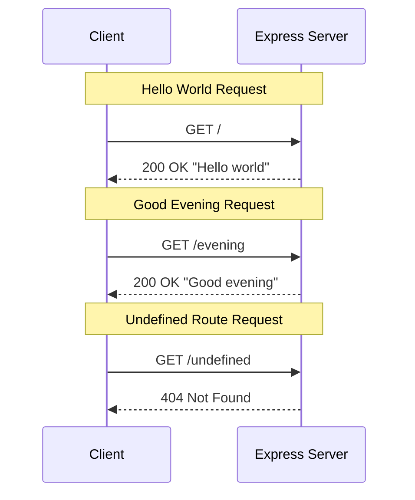

# API Reference - Endpoints

This document provides comprehensive API specifications for all HTTP endpoints available in the Node.js Server Tutorial application. These endpoints are implemented using Express.js 5.2.1 and demonstrate basic HTTP routing patterns.

**Implementation Source:** [docs/examples/app.js](../examples/app.js)  
**Native HTTP Alternative:** [docs/examples/server.js](../examples/server.js)

---

## Table of Contents

- [Endpoints Overview](#endpoints-overview)
- [GET /](#get-)
- [GET /evening](#get-evening)
- [Response Formats](#response-formats)
- [Error Handling](#error-handling)
- [Testing the Endpoints](#testing-the-endpoints)
- [Related Documentation](#related-documentation)

---

## Endpoints Overview

The application exposes two HTTP GET endpoints that return greeting messages as plain text responses.

### Endpoint Summary Table

| Endpoint | Method | Description | Response |
|----------|--------|-------------|----------|
| `/` | GET | Returns a hello greeting | `Hello world` |
| `/evening` | GET | Returns an evening greeting | `Good evening` |

### Request Flow Diagram



### Base URL

All endpoints are served from the base URL when running locally:

```
http://localhost:3000
```

---

## GET /

Returns a "Hello world" greeting message.

### Description

This is the root endpoint of the application. When accessed via HTTP GET request, it returns a simple plain text greeting "Hello world". This endpoint demonstrates the most basic form of HTTP response in Express.js.

### URL

```
/
```

### Method

```
GET
```

### Request Parameters

| Parameter | Type | Required | Description |
|-----------|------|----------|-------------|
| None | - | - | This endpoint accepts no parameters |

### Request Headers

| Header | Required | Description |
|--------|----------|-------------|
| None | - | No specific headers required |

### Request Body

No request body is required or expected for this endpoint.

### Success Response

| Attribute | Value |
|-----------|-------|
| **HTTP Status Code** | `200 OK` |
| **Content-Type** | `text/html; charset=utf-8` |
| **Response Body** | `Hello world` |

### Response Headers

```http
HTTP/1.1 200 OK
X-Powered-By: Express
Content-Type: text/html; charset=utf-8
Content-Length: 11
Date: [Current Date]
Connection: keep-alive
Keep-Alive: timeout=5
```

### Example Request

Using curl:

```bash
curl http://localhost:3000/
```

Using curl with verbose output:

```bash
curl -v http://localhost:3000/
```

### Example Response

```
Hello world
```

### Complete curl Session Example

```bash
$ curl -i http://localhost:3000/
HTTP/1.1 200 OK
X-Powered-By: Express
Content-Type: text/html; charset=utf-8
Content-Length: 11
Date: Tue, 03 Dec 2024 10:00:00 GMT
Connection: keep-alive
Keep-Alive: timeout=5

Hello world
```

### Source Code Reference

**Express.js Implementation:** [docs/examples/app.js](../examples/app.js) (lines 101-107)

```javascript
app.get('/', (req, res) => {
    res.send('Hello world');
});
```

**Native HTTP Implementation:** [docs/examples/server.js](../examples/server.js) (lines 131-164)

```javascript
if (req.url === '/') {
    res.writeHead(200, { 'Content-Type': 'text/plain' });
    res.end('Hello world');
}
```

---

## GET /evening

Returns a "Good evening" greeting message.

### Description

This endpoint returns an evening-specific greeting. It demonstrates how to add multiple routes to an Express.js application. When accessed via HTTP GET request, it returns the plain text message "Good evening".

### URL

```
/evening
```

### Method

```
GET
```

### Request Parameters

| Parameter | Type | Required | Description |
|-----------|------|----------|-------------|
| None | - | - | This endpoint accepts no parameters |

### Request Headers

| Header | Required | Description |
|--------|----------|-------------|
| None | - | No specific headers required |

### Request Body

No request body is required or expected for this endpoint.

### Success Response

| Attribute | Value |
|-----------|-------|
| **HTTP Status Code** | `200 OK` |
| **Content-Type** | `text/html; charset=utf-8` |
| **Response Body** | `Good evening` |

### Response Headers

```http
HTTP/1.1 200 OK
X-Powered-By: Express
Content-Type: text/html; charset=utf-8
Content-Length: 12
Date: [Current Date]
Connection: keep-alive
Keep-Alive: timeout=5
```

### Example Request

Using curl:

```bash
curl http://localhost:3000/evening
```

Using curl with verbose output:

```bash
curl -v http://localhost:3000/evening
```

### Example Response

```
Good evening
```

### Complete curl Session Example

```bash
$ curl -i http://localhost:3000/evening
HTTP/1.1 200 OK
X-Powered-By: Express
Content-Type: text/html; charset=utf-8
Content-Length: 12
Date: Tue, 03 Dec 2024 10:00:00 GMT
Connection: keep-alive
Keep-Alive: timeout=5

Good evening
```

### Source Code Reference

**Express.js Implementation:** [docs/examples/app.js](../examples/app.js) (lines 129-135)

```javascript
app.get('/evening', (req, res) => {
    res.send('Good evening');
});
```

> **Note:** The native HTTP server implementation in `server.js` only includes the root endpoint (`/`). The `/evening` endpoint is exclusive to the Express.js implementation.

---

## Response Formats

### Content Type

All endpoints in this application return plain text responses.

| Format | Content-Type Header | Description |
|--------|---------------------|-------------|
| Plain Text | `text/html; charset=utf-8` | Express.js default for string responses via `res.send()` |
| Plain Text | `text/plain` | Native HTTP module response (in `server.js`) |

### Response Encoding

All responses use UTF-8 character encoding, ensuring proper handling of text content.

### Response Structure

The responses are simple string values without any wrapper structure:

| Endpoint | Response Type | Response Value |
|----------|---------------|----------------|
| `GET /` | String | `Hello world` |
| `GET /evening` | String | `Good evening` |

### Express.js res.send() Behavior

When using `res.send()` in Express.js:

1. **Automatic Content-Type Detection**: Express automatically sets the `Content-Type` header based on the response type
2. **Content-Length Calculation**: The response length is automatically calculated and set
3. **HEAD Request Support**: Express automatically handles HEAD requests by sending headers without body
4. **ETag Generation**: Express can generate ETags for caching (configurable)

### Response Size

| Endpoint | Response Length | Bytes |
|----------|-----------------|-------|
| `GET /` | 11 characters | 11 bytes |
| `GET /evening` | 12 characters | 12 bytes |

---

## Error Handling

### 404 Not Found

When a request is made to an undefined route, the server responds with a 404 Not Found error.

#### Error Response Details

| Attribute | Value |
|-----------|-------|
| **HTTP Status Code** | `404 Not Found` |
| **Content-Type** | `text/html; charset=utf-8` |
| **Response Body** | Express default 404 page or custom message |

#### Example: Requesting an Undefined Route

```bash
curl -i http://localhost:3000/undefined-path
```

#### Expected Response (Express.js Default)

```http
HTTP/1.1 404 Not Found
X-Powered-By: Express
Content-Type: text/html; charset=utf-8
Content-Length: [varies]
Date: [Current Date]

<!DOCTYPE html>
<html lang="en">
<head>
<meta charset="utf-8">
<title>Error</title>
</head>
<body>
<pre>Cannot GET /undefined-path</pre>
</body>
</html>
```

#### Native HTTP Server 404 Response

The native HTTP server implementation in `server.js` returns a custom 404 message:

```bash
$ curl http://localhost:3000/undefined-path
404 Not Found - The requested path does not exist
```

**Source:** [docs/examples/server.js](../examples/server.js) (lines 166-191)

### Common Error Scenarios

| Scenario | URL Example | Status Code | Description |
|----------|-------------|-------------|-------------|
| Undefined route | `/api` | 404 | Route not defined |
| Typo in path | `/evning` | 404 | Misspelled endpoint |
| Extra path segments | `/evening/today` | 404 | Path doesn't exist |
| Query string on undefined route | `/other?param=value` | 404 | Base route not found |

### Valid Routes Summary

To avoid 404 errors, use only these defined routes:

| Route | Status |
|-------|--------|
| `GET /` | ✅ Valid |
| `GET /evening` | ✅ Valid |
| All other routes | ❌ Returns 404 |

---

## Testing the Endpoints

### Prerequisites

Before testing the endpoints, ensure:

1. **Node.js is installed** (version 22.x LTS recommended)
   ```bash
   node --version
   # Should output: v22.x.x
   ```

2. **Dependencies are installed**
   ```bash
   npm install
   ```

3. **Server is running** on port 3000
   ```bash
   node docs/examples/app.js
   ```
   
   Expected startup output:
   ```
   Express server running at http://localhost:3000
   Available endpoints:
     GET http://localhost:3000/        → "Hello world"
     GET http://localhost:3000/evening → "Good evening"
   ```

### Testing Steps

#### Step 1: Test the Root Endpoint (Hello World)

Open a new terminal window and run:

```bash
curl http://localhost:3000/
```

**Expected Output:**
```
Hello world
```

**Verification Checklist:**
- [ ] Response is exactly `Hello world`
- [ ] No error messages
- [ ] Response appears immediately

#### Step 2: Test the Evening Endpoint (Good Evening)

```bash
curl http://localhost:3000/evening
```

**Expected Output:**
```
Good evening
```

**Verification Checklist:**
- [ ] Response is exactly `Good evening`
- [ ] No error messages
- [ ] Response appears immediately

#### Step 3: Test 404 Error Handling

```bash
curl http://localhost:3000/nonexistent
```

**Expected Behavior:**
- Returns HTTP 404 status
- Response body indicates route not found

### Testing with Additional curl Options

#### View Response Headers

```bash
curl -i http://localhost:3000/
```

#### Verbose Mode (Full Request/Response Details)

```bash
curl -v http://localhost:3000/
```

#### Only Show HTTP Status Code

```bash
curl -s -o /dev/null -w "%{http_code}" http://localhost:3000/
# Output: 200
```

#### Save Response to File

```bash
curl http://localhost:3000/ -o response.txt
```

### Testing Summary Table

| Test | Command | Expected Result |
|------|---------|-----------------|
| Root endpoint | `curl http://localhost:3000/` | `Hello world` |
| Evening endpoint | `curl http://localhost:3000/evening` | `Good evening` |
| 404 error | `curl http://localhost:3000/invalid` | 404 Not Found |
| HTTP status check | `curl -s -o /dev/null -w "%{http_code}" http://localhost:3000/` | `200` |

### Alternative Testing Methods

#### Using a Web Browser

1. Open your web browser
2. Navigate to `http://localhost:3000/`
3. The page should display: `Hello world`
4. Navigate to `http://localhost:3000/evening`
5. The page should display: `Good evening`

#### Using Postman or Insomnia

1. Create a new GET request
2. Set the URL to `http://localhost:3000/` or `http://localhost:3000/evening`
3. Click Send
4. Verify the response body and status code

#### Using Node.js fetch (programmatic testing)

```javascript
// Test script example
async function testEndpoints() {
    // Test root endpoint
    const response1 = await fetch('http://localhost:3000/');
    const text1 = await response1.text();
    console.log('GET / :', text1);
    
    // Test evening endpoint
    const response2 = await fetch('http://localhost:3000/evening');
    const text2 = await response2.text();
    console.log('GET /evening :', text2);
}

testEndpoints();
```

---

## Related Documentation

### Tutorial Guides

| Document | Description |
|----------|-------------|
| [Express.js Setup Tutorial](../tutorials/express-setup.md) | Learn how to install and configure Express.js |
| [Adding Endpoints Tutorial](../tutorials/adding-endpoints.md) | Step-by-step guide for creating new routes |
| [Native HTTP Server Tutorial](../tutorials/native-http-server.md) | Understanding the native Node.js HTTP module |

### Getting Started

| Document | Description |
|----------|-------------|
| [Prerequisites](../getting-started/prerequisites.md) | System requirements and environment setup |
| [Installation Guide](../getting-started/installation.md) | Complete installation instructions |

### Code Examples

| File | Description |
|------|-------------|
| [app.js](../examples/app.js) | Complete Express.js application with both endpoints |
| [server.js](../examples/server.js) | Native Node.js HTTP server implementation |

### Project Root

| Document | Description |
|----------|-------------|
| [README.md](../../README.md) | Main project documentation and quick start guide |

---

## Quick Reference Card

### Endpoints at a Glance

```
┌─────────────────────────────────────────────────────────────┐
│                    API QUICK REFERENCE                      │
├─────────────────────────────────────────────────────────────┤
│  Base URL:  http://localhost:3000                           │
├─────────────────────────────────────────────────────────────┤
│  ENDPOINT          METHOD    RESPONSE                       │
│  /                 GET       "Hello world"                  │
│  /evening          GET       "Good evening"                 │
├─────────────────────────────────────────────────────────────┤
│  STATUS CODES                                               │
│  200 OK           Success                                   │
│  404 Not Found    Undefined route                           │
├─────────────────────────────────────────────────────────────┤
│  CURL EXAMPLES                                              │
│  curl http://localhost:3000/                                │
│  curl http://localhost:3000/evening                         │
└─────────────────────────────────────────────────────────────┘
```

---

*Last Updated: December 2024*  
*Express.js Version: 5.2.1*  
*Node.js Version: 22.x LTS*
