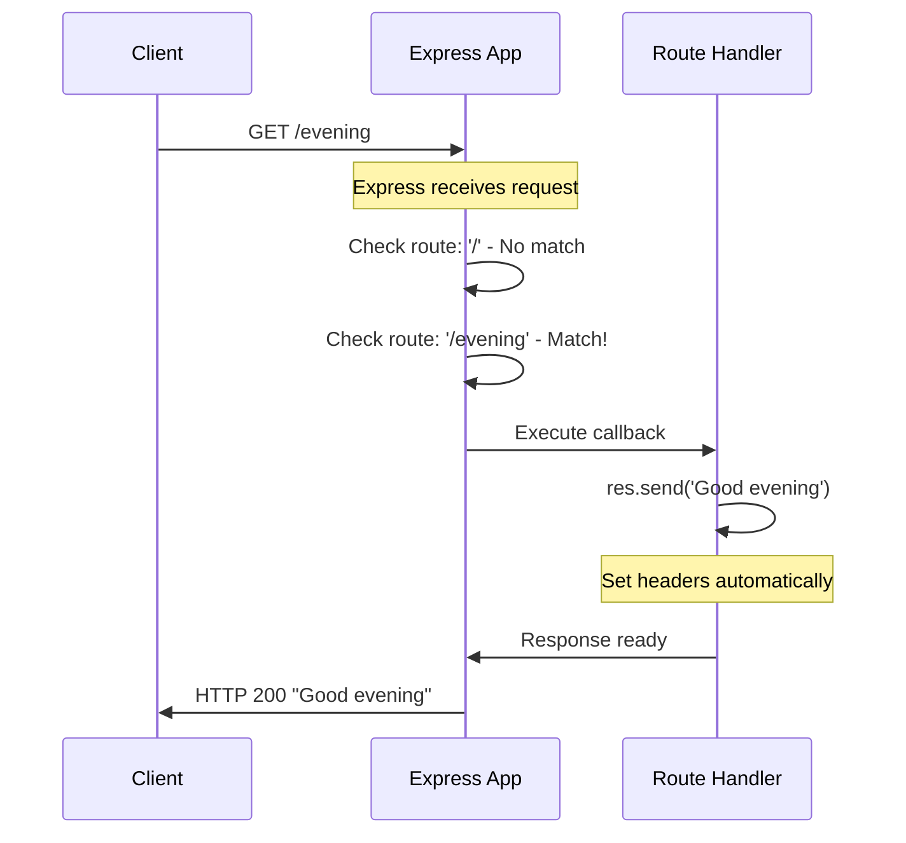
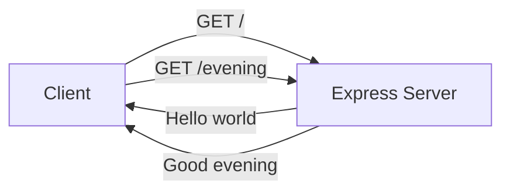

# Adding Endpoints with Express.js

Welcome to the third tutorial in our Node.js server series! In this guide, you'll learn how to add multiple endpoints to your Express.js application. Building on the knowledge from the previous tutorial, we'll explore Express routing in depth and implement a new "Good evening" endpoint.

## Prerequisites

Before starting this tutorial, ensure you have:

- Completed the [Express.js Setup Tutorial](./express-setup.md)
- **Node.js 22.x LTS** (Long Term Support) installed on your system
- Express.js 5.2.1 installed in your project
- Understanding of basic Express.js concepts (`app.get()`, `res.send()`)
- A text editor (VS Code, Sublime Text, or any editor of your choice)
- Terminal or command prompt access

To verify your environment, run:

```bash
node --version
npm list express
```

You should see Node.js `v22.x.x` and Express `5.2.1` in the output.

## Learning Objectives

By the end of this tutorial, you will:

- Understand Express.js routing concepts and patterns
- Know the different HTTP methods available in Express
- Learn route path syntax and matching rules
- Implement multiple GET routes in a single application
- Create the "Good evening" endpoint at `/evening`
- Understand different response methods in Express
- Test multiple endpoints using curl and browser

## Overview

### What You'll Build

In this tutorial, we'll enhance our Express application to include:

| Endpoint | Method | Response |
|----------|--------|----------|
| `/` | GET | "Hello world" |
| `/evening` | GET | "Good evening" |

This demonstrates how Express.js makes it simple to create multiple routes, each with their own handler function.

### Why Multiple Endpoints?

Real-world web applications need multiple endpoints to:

- Serve different pages or views
- Provide various API functionalities
- Handle different types of user requests
- Separate concerns and organize code logically

Express.js makes managing multiple endpoints straightforward with its intuitive routing API.

---

## Express Routing Basics

### What is Routing?

Routing refers to how an application responds to client requests at particular endpoints. Each route is defined by:

1. **HTTP Method**: The type of request (GET, POST, PUT, DELETE, etc.)
2. **Path**: The URL pattern to match (e.g., `/`, `/users`, `/api/data`)
3. **Handler**: A function that processes the request and sends a response

### Understanding HTTP Methods

Express provides methods for all HTTP request types:

| Express Method | HTTP Verb | Typical Use Case |
|----------------|-----------|------------------|
| `app.get()` | GET | Retrieve data or render pages |
| `app.post()` | POST | Create new resources |
| `app.put()` | PUT | Update existing resources |
| `app.delete()` | DELETE | Remove resources |
| `app.patch()` | PATCH | Partial resource updates |
| `app.all()` | ALL | Handle all HTTP methods for a path |

In this tutorial, we focus on **GET requests**, which are used to retrieve information from the server.

### Route Path Syntax

Express supports several path pattern types:

| Pattern Type | Example | Matches |
|--------------|---------|---------|
| **Exact path** | `/` | Root path only |
| **Specific path** | `/evening` | Only `/evening` |
| **Path with parameters** | `/users/:id` | `/users/123`, `/users/abc` |
| **Wildcard** | `/api/*` | Any path starting with `/api/` |

For this tutorial, we'll use exact paths (`/` and `/evening`).

### Route Handler Function Signature

Every route handler receives two objects:

```javascript
app.get('/path', (req, res) => {
    // Handler code here
});
```

| Parameter | Type | Description |
|-----------|------|-------------|
| `req` | Request | Contains request information (headers, parameters, body) |
| `res` | Response | Methods to send responses back to the client |

The **Request object (`req`)** provides information about the incoming request:

| Property | Description |
|----------|-------------|
| `req.url` | The full URL of the request |
| `req.method` | The HTTP method (GET, POST, etc.) |
| `req.params` | URL route parameters (e.g., `:id`) |
| `req.query` | Query string parameters (e.g., `?name=value`) |
| `req.headers` | HTTP headers sent by the client |
| `req.body` | Request body (requires middleware) |

The **Response object (`res`)** provides methods to send responses:

| Method | Description |
|--------|-------------|
| `res.send()` | Send a response of various types |
| `res.json()` | Send a JSON response |
| `res.status()` | Set the HTTP status code |
| `res.redirect()` | Redirect to another URL |
| `res.sendFile()` | Send a file as the response |

---

## Adding GET Routes

### The app.get() Method

The `app.get()` method registers a handler for HTTP GET requests:

```javascript
app.get(path, callback)
```

| Parameter | Type | Description |
|-----------|------|-------------|
| `path` | String | URL path pattern to match |
| `callback` | Function | Handler function `(req, res) => { ... }` |

### Creating a Basic GET Route

Here's the simplest form of a GET route:

```javascript
app.get('/example', (req, res) => {
    res.send('This is an example response');
});
```

When a client makes a GET request to `/example`, Express:

1. Receives the incoming request
2. Matches the URL to the registered route
3. Executes the callback function
4. Sends the response back to the client

### The Response Object: res.send()

The `res.send()` method is versatile and handles different response types automatically:

```javascript
// String response (text/html)
res.send('Hello world');

// Object/Array response (application/json)
res.send({ message: 'Hello' });

// Buffer response (application/octet-stream)
res.send(Buffer.from('data'));
```

**Key features of `res.send()`:**

| Feature | Description |
|---------|-------------|
| **Auto Content-Type** | Sets appropriate Content-Type header |
| **Auto Content-Length** | Calculates and sets the header |
| **Auto end()** | Ends the response automatically |
| **ETag support** | Generates ETags for caching |

### Route Matching Order

Express matches routes in the order they are defined. This is important when routes might overlap:

```javascript
// First defined route
app.get('/', (req, res) => {
    res.send('Home page');
});

// Second defined route
app.get('/evening', (req, res) => {
    res.send('Good evening');
});
```

Express processes routes sequentially until it finds a match. Once a response is sent, routing stops.

---

## The Good Evening Endpoint

Now let's implement the "Good evening" endpoint step by step.

### Step 1: Review Your Current Application

If you completed the previous tutorial, you should have an `app.js` file with this structure:

```javascript
const express = require('express');
const app = express();
const PORT = 3000;

// Hello world route (from previous tutorial)
app.get('/', (req, res) => {
    res.send('Hello world');
});

app.listen(PORT, () => {
    console.log(`Server running at http://localhost:${PORT}/`);
});
```

### Step 2: Add the Evening Route

Add the following route **before** the `app.listen()` call:

```javascript
app.get('/evening', (req, res) => {
    res.send('Good evening');
});
```

**Breaking down this code:**

| Component | Description |
|-----------|-------------|
| `app.get()` | Registers a GET route handler |
| `'/evening'` | The URL path to match |
| `(req, res)` | Callback function parameters |
| `res.send()` | Sends the response and ends it |
| `'Good evening'` | The exact response text |

### Step 3: Understanding the Implementation

Let's examine what happens when a client requests `/evening`:



### Step 4: Complete Application Code

Here is the complete `app.js` with both endpoints:

```javascript
/**
 * Express.js Application with Multiple Endpoints
 * 
 * This application demonstrates adding multiple routes using Express.js.
 * It includes two GET endpoints that return greeting messages.
 * 
 * Source: docs/examples/app.js
 */

const express = require('express');
const app = express();
const PORT = 3000;

/**
 * Root Endpoint: GET /
 * Returns "Hello world" as a plain text response.
 * 
 * @route GET /
 * @returns {string} 200 - "Hello world"
 */
app.get('/', (req, res) => {
    res.send('Hello world');
});

/**
 * Evening Endpoint: GET /evening
 * Returns "Good evening" as a plain text response.
 * 
 * @route GET /evening
 * @returns {string} 200 - "Good evening"
 */
app.get('/evening', (req, res) => {
    res.send('Good evening');
});

/**
 * Start the Express server
 * Listens on port 3000 for incoming HTTP connections.
 */
app.listen(PORT, () => {
    console.log(`Server running at http://localhost:${PORT}/`);
    console.log('Available endpoints:');
    console.log(`  GET /        → "Hello world"`);
    console.log(`  GET /evening → "Good evening"`);
});
```

> **Reference**: For a more detailed version with comprehensive comments, see [docs/examples/app.js](../examples/app.js).

---

## Response Handling

Express provides multiple methods for sending responses. Understanding these helps you choose the right approach for different scenarios.

### Response Methods Comparison

| Method | Use Case | Content-Type |
|--------|----------|--------------|
| `res.send()` | General purpose responses | Auto-detected |
| `res.json()` | JSON API responses | `application/json` |
| `res.text()` | Plain text responses | `text/plain` |
| `res.html()` | HTML responses | `text/html` |
| `res.sendFile()` | File downloads | Based on file type |
| `res.render()` | Template rendering | `text/html` |

### Using res.send()

The `res.send()` method automatically determines the Content-Type:

```javascript
// String → text/html (default for strings)
res.send('Hello world');

// Object → application/json
res.send({ greeting: 'Hello world' });

// Array → application/json
res.send(['Hello', 'world']);
```

### Using res.json()

For explicit JSON responses, use `res.json()`:

```javascript
app.get('/api/greeting', (req, res) => {
    res.json({
        message: 'Good evening',
        timestamp: new Date().toISOString()
    });
});
```

### Setting Status Codes

Use `res.status()` to set HTTP status codes:

```javascript
// Success with custom status
res.status(201).send('Created successfully');

// Error response
res.status(404).send('Resource not found');

// Chaining with json()
res.status(200).json({ success: true });
```

### Common HTTP Status Codes

| Code | Status | Meaning |
|------|--------|---------|
| 200 | OK | Request succeeded |
| 201 | Created | Resource created successfully |
| 400 | Bad Request | Invalid request syntax |
| 404 | Not Found | Resource not found |
| 500 | Internal Server Error | Server error |

### Content-Type Headers

Express sets Content-Type automatically, but you can override it:

```javascript
// Explicitly set Content-Type
res.set('Content-Type', 'text/plain');
res.send('Plain text response');

// Or use the type() method
res.type('text/plain').send('Plain text response');
```

---

## Testing Instructions

Let's verify that both endpoints work correctly.

### Running the Server

1. Save your complete `app.js` file

2. Start the server:

```bash
node app.js
```

3. You should see:

```
Server running at http://localhost:3000/
Available endpoints:
  GET /        → "Hello world"
  GET /evening → "Good evening"
```

### Testing with curl

Open a new terminal window and test each endpoint:

**Test the Hello World endpoint:**

```bash
curl http://localhost:3000/
```

**Expected output:**

```
Hello world
```

**Test the Good Evening endpoint:**

```bash
curl http://localhost:3000/evening
```

**Expected output:**

```
Good evening
```

**Test both endpoints with verbose output:**

```bash
curl -v http://localhost:3000/evening
```

This shows the complete HTTP response including headers:

```
*   Trying 127.0.0.1:3000...
* Connected to localhost (127.0.0.1) port 3000 (#0)
> GET /evening HTTP/1.1
> Host: localhost:3000
> User-Agent: curl/8.1.2
> Accept: */*
> 
< HTTP/1.1 200 OK
< Content-Type: text/html; charset=utf-8
< Content-Length: 12
< ETag: W/"c-YkRqPBWZ6BmQ7bVnqR8HYcYB2TY"
< Date: Tue, 03 Dec 2024 12:00:00 GMT
< Connection: keep-alive
< Keep-Alive: timeout=5
< 
* Connection #0 to host localhost left intact
Good evening
```

### Testing with a Web Browser

Open your web browser and navigate to:

1. **Hello World**: `http://localhost:3000/`
   - Should display: `Hello world`

2. **Good Evening**: `http://localhost:3000/evening`
   - Should display: `Good evening`

### Testing Non-Existent Routes

Verify that Express handles undefined routes:

```bash
curl http://localhost:3000/undefined
```

**Expected output (Express default 404):**

```html
<!DOCTYPE html>
<html lang="en">
<head>
<meta charset="utf-8">
<title>Error</title>
</head>
<body>
<pre>Cannot GET /undefined</pre>
</body>
</html>
```

Express automatically returns a 404 response for routes that aren't defined.

### Stopping the Server

Press `Ctrl+C` in the terminal where the server is running to stop it.

---

## Summary

Congratulations! You've successfully added a new endpoint to your Express.js application. Let's recap what you learned:

| Concept | What You Learned |
|---------|------------------|
| **Express Routing** | How routes map HTTP methods and paths to handler functions |
| **HTTP Methods** | GET, POST, PUT, DELETE and their purposes |
| **Route Paths** | Exact paths, parameters, and wildcards |
| **Handler Functions** | The `(req, res)` signature and how to use each object |
| **Adding Routes** | How to use `app.get()` to create new endpoints |
| **Response Methods** | `res.send()`, `res.json()`, `res.status()` |
| **Good Evening Endpoint** | Complete implementation of GET /evening |
| **Testing** | Using curl and browser to verify endpoints |

### Key Takeaways

1. **Express routing is intuitive** - `app.get('/path', handler)` is easy to read and write
2. **Multiple endpoints are simple** - Just add more `app.get()` calls
3. **Routes are matched in order** - Define more specific routes before general ones
4. **Response handling is automatic** - `res.send()` handles Content-Type for you
5. **Express provides sensible defaults** - 404 handling works out of the box
6. **Testing is straightforward** - Use curl or browser to verify functionality

### What You Built

Your application now has two fully functional endpoints:



---

## Next Steps

Now that you've learned how to add multiple endpoints, you're ready to explore more advanced Express.js features! Here are some suggestions:

### Immediate Next Steps

- **API Reference**: See the [Endpoints API Reference](../api-reference/endpoints.md) for complete documentation of the endpoints you've created
- **Complete Example**: Review [docs/examples/app.js](../examples/app.js) for a fully commented version of the application

### Further Learning

| Topic | Description |
|-------|-------------|
| **Route Parameters** | Learn to create dynamic routes like `/users/:id` |
| **Query Strings** | Handle URL parameters like `?name=value` |
| **Middleware** | Add reusable request processing functions |
| **POST Requests** | Create endpoints that accept data from clients |
| **Error Handling** | Implement custom error handlers |
| **Static Files** | Serve CSS, JavaScript, and images |

### Practice Exercises

Try adding these endpoints to your application:

1. `GET /morning` - Returns "Good morning"
2. `GET /afternoon` - Returns "Good afternoon"
3. `GET /greet/:name` - Returns "Hello, [name]!" with a dynamic name

---

**See Also:**

- [Prerequisites](../getting-started/prerequisites.md) - Environment setup requirements
- [Installation Guide](../getting-started/installation.md) - Project initialization steps
- [Native HTTP Server Tutorial](./native-http-server.md) - Understanding the basics
- [Express.js Setup Tutorial](./express-setup.md) - Framework installation and configuration
- [API Reference](../api-reference/endpoints.md) - Complete endpoint specifications
- [Complete Express Example](../examples/app.js) - Full code with detailed comments
