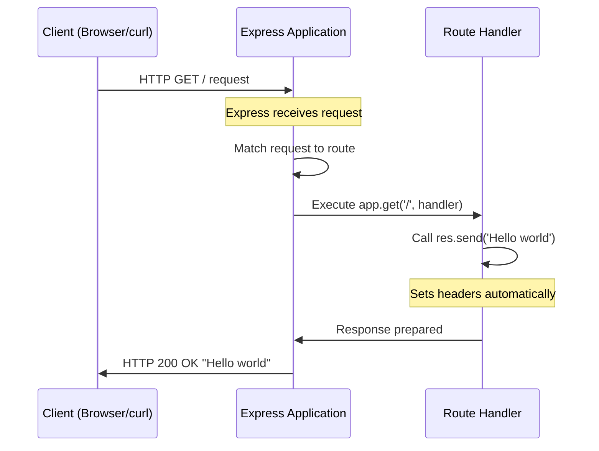

# Setting Up Express.js

Welcome to the second tutorial in our Node.js server series! In this guide, you'll learn how to add Express.js to your project and migrate from the native HTTP server we created in the previous tutorial. Express.js simplifies server development with cleaner syntax and powerful features.

## Prerequisites

Before starting this tutorial, ensure you have:

- Completed the [Native HTTP Server Tutorial](./native-http-server.md)
- **Node.js 22.x LTS** (Long Term Support) installed on your system
- Basic understanding of JavaScript and HTTP concepts
- A text editor (VS Code, Sublime Text, or any editor of your choice)
- Terminal or command prompt access

To verify your Node.js installation, run:

```bash
node --version
```

You should see output like `v22.x.x`. Express.js 5.x requires Node.js 18 or higher.

## Learning Objectives

By the end of this tutorial, you will:

- Understand why Express.js is beneficial over native HTTP
- Install Express.js 5.2.1 using npm
- Create an Express application instance
- Migrate the "Hello world" endpoint from native HTTP to Express
- Use Express's simplified routing and response methods
- Run and test your Express server

## Why Express.js?

### The Challenges of Native HTTP

In the previous tutorial, we created a server using Node.js's native `http` module. While this approach works, it has several limitations:

| Native HTTP Limitation | Description |
|------------------------|-------------|
| **Manual Routing** | You must write if/else statements to handle different URLs |
| **No Middleware** | No built-in way to add reusable request processors |
| **Verbose Code** | Common operations require more lines of code |
| **Manual Response Handling** | Must manually set headers and call multiple methods |

### Enter Express.js

Express.js is a minimal and flexible Node.js web application framework that addresses these limitations. It is designed for building web applications and APIs with a robust set of features.

**Key benefits of Express.js:**

| Benefit | Description |
|---------|-------------|
| **Simplified Routing** | Define routes with intuitive methods like `app.get()`, `app.post()` |
| **Middleware Support** | Easily add authentication, logging, body parsing, and more |
| **Cleaner Code** | `res.send()` replaces `res.writeHead()` + `res.end()` |
| **Rich Ecosystem** | Thousands of community plugins available |
| **Automatic Headers** | Content-Type and Content-Length set automatically |

### Express.js 5.0: A Major Milestone

Express.js version 5.0 was released on October 15, 2024, marking a significant milestone after a 10-year wait since the initial pull request was opened in July 2014. This release brought important improvements:

- **Dropped support for Node.js versions before v18** - ensuring modern JavaScript features
- **Improved async/await support** - better error handling in asynchronous code
- **Enhanced security features** - ReDoS mitigation and other security improvements
- **Modernized codebase** - updated for current JavaScript standards

We'll be using **Express.js 5.2.1**, the latest stable release, in this tutorial.

### Express.js: The Framework Overview

Express.js is a back end web application framework for Node.js, released as free and open-source software under the MIT License. It has become one of the most popular frameworks in the Node.js ecosystem due to its:

- **Minimalist design** - provides essential features without bloat
- **Flexibility** - doesn't enforce strict application structure
- **Performance** - thin layer over Node.js with minimal overhead
- **Community** - extensive documentation and community support

## Installation

### Step 1: Verify Node.js Version

First, confirm you have Node.js 18 or higher installed (22.x LTS recommended):

```bash
node --version
```

Expected output: `v22.x.x`

If your version is below v18, update Node.js before proceeding.

### Step 2: Initialize npm Project (If Not Done)

If you haven't already initialized your project, run:

```bash
npm init -y
```

This creates a `package.json` file with default settings.

### Step 3: Install Express.js

Install Express.js 5.2.1 using npm:

```bash
npm install express@5.2.1
```

You should see output similar to:

```
added 64 packages in 2s
```

### Step 4: Verify Installation

Confirm Express.js is installed correctly:

```bash
npm list express
```

Expected output:

```
nodejs-server-tutorial@1.0.0
└── express@5.2.1
```

### Understanding package.json

After installation, your `package.json` will include Express as a dependency:

```json
{
  "name": "nodejs-server-tutorial",
  "version": "1.0.0",
  "dependencies": {
    "express": "^5.2.1"
  }
}
```

The `^5.2.1` notation means npm will accept any version `5.x.x` that is `>= 5.2.1`.

## Basic Express Setup

### Step 1: Import Express

Create a new file called `app.js` and import Express:

```javascript
const express = require('express');
```

Unlike the native `http` module, Express is not a built-in module. It must be installed via npm before you can import it.

### Step 2: Create an Express Application

Call the `express()` function to create an application instance:

```javascript
const app = express();
```

The `app` object is the central piece of your Express server. It provides methods for:

| Method | Purpose |
|--------|---------|
| `app.get()` | Handle HTTP GET requests |
| `app.post()` | Handle HTTP POST requests |
| `app.put()` | Handle HTTP PUT requests |
| `app.delete()` | Handle HTTP DELETE requests |
| `app.use()` | Mount middleware functions |
| `app.listen()` | Start listening for connections |

### Step 3: Define the Port

Define which port the server will listen on:

```javascript
const PORT = 3000;
```

### Complete Basic Setup

Here's the complete setup code:

```javascript
const express = require('express');
const app = express();
const PORT = 3000;
```

That's just 3 lines compared to the native HTTP approach! Now let's add routes.

## Migration from Native HTTP

One of the biggest advantages of Express.js is how it simplifies your code. Let's compare the native HTTP approach to Express.

### Side-by-Side Comparison

**Native HTTP Server (from previous tutorial):**

```javascript
const http = require('http');
const PORT = 3000;

const server = http.createServer((req, res) => {
  if (req.url === '/' && req.method === 'GET') {
    res.writeHead(200, { 'Content-Type': 'text/plain' });
    res.end('Hello world');
  } else {
    res.writeHead(404, { 'Content-Type': 'text/plain' });
    res.end('Not Found');
  }
});

server.listen(PORT, () => {
  console.log(`Server running at http://localhost:${PORT}/`);
});
```

**Express.js Server (equivalent):**

```javascript
const express = require('express');
const app = express();
const PORT = 3000;

app.get('/', (req, res) => {
  res.send('Hello world');
});

app.listen(PORT, () => {
  console.log(`Server running at http://localhost:${PORT}/`);
});
```

### Architecture Comparison

The following diagram illustrates the fundamental differences between native HTTP and Express.js approaches:

```mermaid
graph TB
    subgraph "Native HTTP Server"
        A1[http.createServer] --> B1[Manual URL Parsing]
        B1 --> C1[if/else Route Handling]
        C1 --> D1[res.writeHead + res.end]
    end
    
    subgraph "Express.js Server"
        A2[express()] --> B2[Automatic Routing]
        B2 --> C2[app.get/post/etc]
        C2 --> D2[res.send]
    end
```

### Key Differences Explained

| Aspect | Native HTTP | Express.js |
|--------|-------------|------------|
| **Server Creation** | `http.createServer(callback)` | `express()` |
| **Routing** | Manual `if/else` on `req.url` | `app.get('/path', handler)` |
| **Response Headers** | `res.writeHead(200, {...})` | Automatic |
| **Sending Response** | `res.end('text')` | `res.send('text')` |
| **404 Handling** | Manual `else` block | Automatic (built-in) |
| **Content-Type** | Manual `'Content-Type': 'text/plain'` | Auto-detected |

### Benefits of Migration

Migrating to Express.js provides several immediate benefits:

1. **Less Code**: The Express version is significantly shorter
2. **Cleaner Routing**: No more if/else chains for URL handling
3. **Automatic Headers**: `res.send()` handles Content-Type automatically
4. **Built-in 404**: Express automatically returns 404 for undefined routes
5. **Extensibility**: Easy to add middleware for logging, authentication, etc.

## Creating Your First Express Route

### The "Hello world" Route

Let's create the same "Hello world" endpoint from the native HTTP tutorial, now using Express:

```javascript
app.get('/', (req, res) => {
  res.send('Hello world');
});
```

**Breaking down this code:**

| Component | Description |
|-----------|-------------|
| `app.get()` | Registers a route handler for HTTP GET requests |
| `'/'` | The URL path to match (root path) |
| `(req, res)` | Callback function parameters |
| `req` | Express Request object (enhanced version of http.IncomingMessage) |
| `res` | Express Response object (enhanced version of http.ServerResponse) |
| `res.send()` | Sends the response and ends it automatically |

### Understanding res.send()

The `res.send()` method is one of Express's most convenient features. It automatically:

1. **Sets Content-Type**: Based on the type of data you send
2. **Sets Content-Length**: Calculates and sets the header
3. **Ends the response**: No need to call `res.end()` separately

```javascript
res.send('Hello world');  // Content-Type: text/html
res.send({ data: 123 });  // Content-Type: application/json
res.send([1, 2, 3]);      // Content-Type: application/json
```

### Starting the Server

To start listening for connections, use `app.listen()`:

```javascript
app.listen(PORT, () => {
  console.log(`Server running at http://localhost:${PORT}/`);
});
```

This method:
- Binds the server to the specified port
- Begins accepting incoming HTTP connections
- Executes the callback once the server is ready

## Complete Express Application

Here's the complete Express.js application with the "Hello world" endpoint:

```javascript
/**
 * Express.js Server Example
 * 
 * A simple Express server that returns "Hello world" at the root path.
 * 
 * Source: docs/examples/app.js
 */

const express = require('express');
const app = express();
const PORT = 3000;

// Define the root route
app.get('/', (req, res) => {
  res.send('Hello world');
});

// Start the server
app.listen(PORT, () => {
  console.log(`Server running at http://localhost:${PORT}/`);
});
```

> **Note**: For a more comprehensive example with detailed comments and multiple endpoints, see [docs/examples/app.js](../examples/app.js).

## Testing the Server

### Running the Express Server

1. Save the code above as `app.js` in your project directory

2. Start the server:

```bash
node app.js
```

3. You should see:

```
Server running at http://localhost:3000/
```

### Testing with curl

Open a new terminal and test your endpoint:

**Test the root endpoint:**

```bash
curl http://localhost:3000/
```

**Expected output:**

```
Hello world
```

**Test a non-existent path:**

```bash
curl http://localhost:3000/nonexistent
```

**Expected output (Express's default 404):**

```html
<!DOCTYPE html>
<html lang="en">
<head>
<meta charset="utf-8">
<title>Error</title>
</head>
<body>
<pre>Cannot GET /nonexistent</pre>
</body>
</html>
```

Notice how Express automatically handles the 404 response without any additional code!

### Testing with a Web Browser

Open your web browser and navigate to:

```
http://localhost:3000/
```

You should see "Hello world" displayed on the page.

### Stopping the Server

To stop the server, press `Ctrl+C` in the terminal where the server is running.

## Express Request Flow

Here's a sequence diagram showing how Express handles a request:



### Request Flow Breakdown

1. **Client sends request**: Browser or curl sends HTTP GET to `http://localhost:3000/`
2. **Express receives**: The application receives and parses the request
3. **Route matching**: Express finds a matching route handler for `GET /`
4. **Handler executes**: The callback function runs
5. **Response sent**: `res.send()` sets headers and sends the response
6. **Client receives**: The client gets the response and displays it

## Summary

Congratulations! You've successfully set up Express.js and migrated from native HTTP. Let's recap what you learned:

| Concept | What You Learned |
|---------|------------------|
| **Express.js benefits** | Simpler routing, middleware, cleaner code |
| **Installation** | How to install Express 5.2.1 via npm |
| **App creation** | How to create an Express application instance |
| **Routing** | How to define routes using `app.get()` |
| **Response handling** | How `res.send()` simplifies sending responses |
| **Migration** | How to convert native HTTP code to Express |

### Key Takeaways

1. **Express.js simplifies server development** with intuitive methods
2. **Less code means fewer bugs** and easier maintenance
3. **Automatic features** like headers and 404 handling save time
4. **Express 5.x requires Node.js 18+** for modern JavaScript support
5. **The migration path is straightforward** from native HTTP

## Next Steps

Now that you have Express.js set up with the "Hello world" endpoint, you're ready to add more routes! In the next tutorial, we'll add the **"Good evening" endpoint** and learn more about Express routing patterns.

**Continue to:** [Adding Endpoints with Express.js](./adding-endpoints.md)

---

**See Also:**
- [Prerequisites](../getting-started/prerequisites.md) - Environment setup requirements
- [Installation Guide](../getting-started/installation.md) - Project initialization steps
- [Native HTTP Server Tutorial](./native-http-server.md) - The foundation we built upon
- [Complete Express Example](../examples/app.js) - Full code with detailed comments
- [API Reference](../api-reference/endpoints.md) - Complete endpoint documentation
