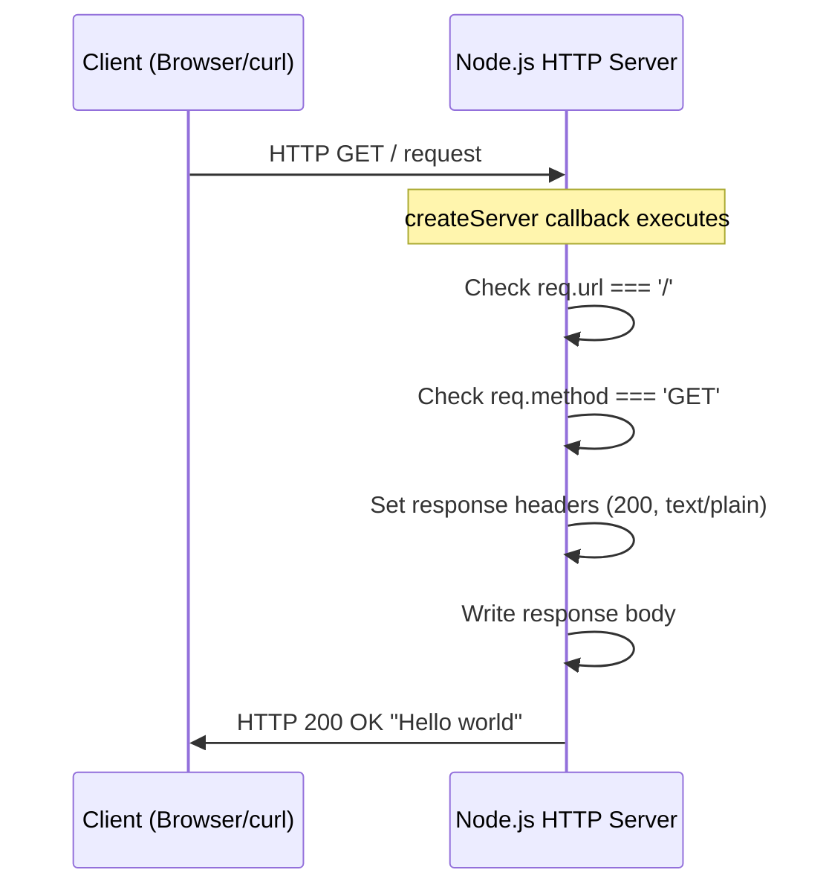

# Creating a Native HTTP Server with Node.js

Welcome to the first tutorial in our Node.js server series! In this guide, you'll learn how to create a basic HTTP server using Node.js's built-in `http` module. This foundational knowledge will help you understand how web servers work before moving on to frameworks like Express.js.

## Prerequisites

Before starting this tutorial, ensure you have:

- **Node.js 22.x LTS** (Long Term Support) installed on your system
- Basic understanding of JavaScript syntax
- A text editor (VS Code, Sublime Text, or any editor of your choice)
- Terminal or command prompt access

To verify your Node.js installation, run:

```bash
node --version
```

You should see output like `v22.x.x`.

## Learning Objectives

By the end of this tutorial, you will:

- Understand how Node.js's native `http` module works
- Learn to create an HTTP server using `http.createServer()`
- Implement basic URL routing to handle different paths
- Send HTTP responses with proper headers and status codes
- Run and test your server locally

## Overview

### What is Node.js?

Node.js is a JavaScript runtime built on Chrome's V8 JavaScript engine. It allows you to run JavaScript code outside of a web browser, making it perfect for building server-side applications.

### The Built-in http Module

Node.js comes with several built-in modules that don't require separate installation. The `http` module is one of the most fundamental, providing everything you need to create HTTP servers and make HTTP requests.

Key features of the `http` module include:

| Feature | Description |
|---------|-------------|
| `http.createServer()` | Creates a new HTTP server instance |
| Request handling | Processes incoming HTTP requests via callback functions |
| Response methods | Provides methods to set headers and send responses |
| Event-based architecture | Uses events for handling connections and errors |

### When to Use Native HTTP vs Frameworks

**Native HTTP is great for:**
- Learning how HTTP servers work fundamentally
- Building extremely lightweight servers
- Situations where you need complete control over request handling
- Educational purposes and understanding core concepts

**Frameworks like Express.js are better for:**
- Production applications with complex routing
- Applications requiring middleware support
- Rapid development with less boilerplate code
- Projects that need extensive community support and plugins

### What We'll Build

In this tutorial, we'll create a simple HTTP server that:
- Listens for incoming connections on port 3000
- Returns "Hello world" when accessing the root path (`/`)
- Returns a 404 error for any other paths

## Creating the Server

### Step 1: Import the http Module

First, we need to import the `http` module. Since it's a built-in Node.js module, no npm installation is required:

```javascript
const http = require('http');
```

This gives us access to all HTTP-related functionality through the `http` object.

### Step 2: Define Configuration Constants

Let's define the port our server will listen on:

```javascript
const PORT = 3000;
```

Port 3000 is commonly used for development servers because:
- It's above 1024 (no administrator privileges required)
- It's a widely recognized convention in the Node.js community
- It doesn't conflict with common system services

### Step 3: Create the Server Instance

Now we create the actual server using `http.createServer()`:

```javascript
const server = http.createServer((req, res) => {
  // Request handler code goes here
});
```

The `createServer()` method accepts a callback function that executes every time the server receives an HTTP request. This callback receives two important objects:

#### The Request Object (req)

The `req` object (`http.IncomingMessage`) contains information about the incoming request:

| Property | Description | Example |
|----------|-------------|---------|
| `req.url` | The request URL path | `'/'`, `'/about'`, `'/api/users'` |
| `req.method` | The HTTP method | `'GET'`, `'POST'`, `'PUT'`, `'DELETE'` |
| `req.headers` | An object containing request headers | `{ 'content-type': 'application/json' }` |
| `req.httpVersion` | The HTTP version used | `'1.1'` |

#### The Response Object (res)

The `res` object (`http.ServerResponse`) is used to send data back to the client:

| Method | Description |
|--------|-------------|
| `res.writeHead(statusCode, headers)` | Sets status code and headers |
| `res.setHeader(name, value)` | Sets a single header |
| `res.write(data)` | Writes data to the response body |
| `res.end(data)` | Ends the response, optionally sending final data |

## Handling Requests

Inside the `createServer()` callback, we need to determine what to do based on the incoming request. This is called **routing**.

### Checking the Request URL

The `req.url` property contains the path portion of the URL. For example:

```
http://localhost:3000/         → req.url = '/'
http://localhost:3000/about    → req.url = '/about'
http://localhost:3000/api/v1   → req.url = '/api/v1'
```

### Checking the Request Method

The `req.method` property tells us what HTTP method was used:

```javascript
if (req.method === 'GET') {
  // Handle GET requests
}
```

### Basic Routing with if/else

Here's how we implement simple routing:

```javascript
const server = http.createServer((req, res) => {
  if (req.url === '/' && req.method === 'GET') {
    // Handle root path GET request
  } else {
    // Handle all other requests
  }
});
```

This pattern checks both the URL and the HTTP method, ensuring we respond correctly to different types of requests.

## Sending Responses

Once we've determined how to handle a request, we need to send an appropriate response.

### Setting Response Headers

HTTP headers provide metadata about the response. The most common header is `Content-Type`, which tells the client what kind of data we're sending.

You can set headers using `res.writeHead()`:

```javascript
res.writeHead(200, { 'Content-Type': 'text/plain' });
```

The `res.writeHead()` method takes two arguments:
1. **Status code**: A number indicating the result (200 = OK, 404 = Not Found, etc.)
2. **Headers object**: Key-value pairs of HTTP headers

### Common HTTP Status Codes

| Code | Name | Use Case |
|------|------|----------|
| 200 | OK | Successful request |
| 201 | Created | Resource successfully created |
| 400 | Bad Request | Invalid request syntax |
| 404 | Not Found | Resource doesn't exist |
| 500 | Internal Server Error | Server-side error |

### Sending the Response Body

Use `res.end()` to send data and complete the response:

```javascript
res.writeHead(200, { 'Content-Type': 'text/plain' });
res.end('Hello world');
```

The `res.end()` method:
1. Sends the provided data as the response body
2. Signals that the response is complete
3. Must be called on every response to prevent hanging connections

### Complete Request Handler

Here's our complete request handling code:

```javascript
const server = http.createServer((req, res) => {
  if (req.url === '/' && req.method === 'GET') {
    res.writeHead(200, { 'Content-Type': 'text/plain' });
    res.end('Hello world');
  } else {
    res.writeHead(404, { 'Content-Type': 'text/plain' });
    res.end('Not Found');
  }
});
```

## Running the Server

### Starting the Server

To make our server start listening for connections, we use the `listen()` method:

```javascript
server.listen(PORT, () => {
  console.log(`Server running at http://localhost:${PORT}/`);
});
```

The `listen()` method accepts:
1. **Port number**: The port to listen on (3000 in our case)
2. **Callback function**: Executed when the server is ready

### Understanding Port Binding

When you call `server.listen(3000)`, Node.js:
1. Binds to port 3000 on your machine
2. Starts accepting incoming TCP connections
3. Calls your callback function once ready

The server continues running until you stop it (Ctrl+C) or an error occurs.

### What is Localhost?

`localhost` (127.0.0.1) refers to your own computer. When developing locally, your server only accepts connections from your machine, which is safe for development.

## HTTP Request Lifecycle

Understanding how requests flow through your server is crucial. Here's a sequence diagram showing the complete request/response cycle:



### Step-by-Step Breakdown

1. **Client sends request**: A browser or tool like curl sends an HTTP GET request to `http://localhost:3000/`

2. **Server receives request**: Node.js accepts the connection and creates `req` and `res` objects

3. **Callback executes**: Your `createServer()` callback function runs

4. **Routing logic**: The code checks `req.url` and `req.method` to determine the action

5. **Headers set**: `res.writeHead()` sets the status code and headers

6. **Response sent**: `res.end()` sends the body and completes the response

7. **Client receives response**: The client receives the data and displays it

## Complete Server Example

Here's the complete, working code for our native HTTP server:

```javascript
/**
 * Native Node.js HTTP Server
 * 
 * A simple HTTP server that returns "Hello world" at the root path.
 * 
 * Source: docs/examples/server.js
 */

const http = require('http');

const PORT = 3000;

const server = http.createServer((req, res) => {
  // Log incoming requests (helpful for debugging)
  console.log(`[${req.method}] ${req.url}`);
  
  if (req.url === '/' && req.method === 'GET') {
    // Handle root path - return "Hello world"
    res.writeHead(200, { 'Content-Type': 'text/plain' });
    res.end('Hello world');
  } else {
    // Handle all other paths - return 404
    res.writeHead(404, { 'Content-Type': 'text/plain' });
    res.end('Not Found');
  }
});

server.listen(PORT, () => {
  console.log(`Server running at http://localhost:${PORT}/`);
});
```

> **Note**: For a more comprehensive example with detailed comments and error handling, see [docs/examples/server.js](../examples/server.js).

## Testing the Server

### Running the Server

1. Save the code above as `server.js` in your project directory

2. Open a terminal and navigate to your project directory

3. Start the server:

```bash
node server.js
```

4. You should see:

```
Server running at http://localhost:3000/
```

### Testing with curl

Open a new terminal window and test your endpoints:

**Test the root endpoint:**

```bash
curl http://localhost:3000/
```

**Expected output:**

```
Hello world
```

**Test a non-existent path:**

```bash
curl http://localhost:3000/nonexistent
```

**Expected output:**

```
Not Found
```

### Testing with a Web Browser

You can also test by opening your web browser and navigating to:

```
http://localhost:3000/
```

You should see "Hello world" displayed on the page.

### Stopping the Server

To stop the server, press `Ctrl+C` in the terminal where the server is running.

## Summary

Congratulations! You've successfully created a native Node.js HTTP server. Let's recap what you learned:

| Concept | What You Learned |
|---------|------------------|
| **http module** | How to import and use Node.js's built-in HTTP module |
| **createServer()** | How to create an HTTP server instance with a request handler |
| **Request object** | How to access URL, method, and headers from incoming requests |
| **Response object** | How to set headers and send responses to clients |
| **Routing** | How to handle different paths using if/else statements |
| **listen()** | How to start the server and listen for connections |

### Limitations of the Native HTTP Approach

While the native `http` module is powerful, it has some limitations:

- **Manual routing**: You must implement all routing logic yourself
- **No middleware**: There's no built-in way to add reusable request processors
- **Verbose code**: Common operations require more code than with frameworks
- **Limited convenience**: No automatic body parsing, query string handling, etc.

These limitations are why most production Node.js applications use frameworks like Express.js.

## Next Steps

Ready to level up your server? In the next tutorial, we'll add **Express.js** to our project, which will make our code cleaner and give us powerful features like:

- Simplified routing with `app.get()`, `app.post()`, etc.
- Middleware support for authentication, logging, and more
- Automatic request body parsing
- A rich ecosystem of community plugins

**Continue to:** [Setting Up Express.js](./express-setup.md)

---

**See Also:**
- [Prerequisites](../getting-started/prerequisites.md) - Environment setup requirements
- [Installation Guide](../getting-started/installation.md) - Project initialization steps
- [Complete Server Example](../examples/server.js) - Full code with detailed comments
